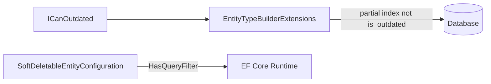

# BudjetMaster — инструкции для Claude

---

# Coding Guidelines для проекта BudjetMaster (.NET 10)

> Настоящий документ является единым стандартом кодирования, документирования и ревью для проекта **BudjetMaster**.
> Все правила обязательны к соблюдению, если явно не указано иное.

---

## Оглавление

1. [Code Style](#1-code-style)
   - 1.1 [Инициализация типов и коллекций](#11-инициализация-типов-и-коллекций)
     - 1.1.1 [Явная типизация при присваивании](#111-явная-типизация-при-присваивании)
     - 1.1.2 [Передача аргументом](#112-передача-аргументом-без-присваивания)
     - 1.1.3 [Пустые коллекции](#113-пустые-коллекции)
     - 1.1.4 [Материализация перечислений](#114-материализация-перечислений)
   - 1.2 [LINQ](#12-linq)
   - 1.3 [Структура и форматирование кода](#13-структура-и-форматирование-кода)
     - 1.3.1 [Условные конструкции](#131-условные-конструкции)
     - 1.3.2 [Пустые строки](#132-пустые-строки)
     - 1.3.3 [Порядок элементов в классе](#133-порядок-элементов-в-классе)
     - 1.3.4 [Именование](#134-именование)
     - 1.3.5 [Namespace](#135-namespace)
     - 1.3.6 [Конструкторы](#136-конструкторы)
     - 1.3.7 [Форматирование inline-комментариев](#137-форматирование-inline-комментариев)
2. [Тестирование](#2-тестирование)
   - 2.1 [Структура тестов](#21-структура-тестов)
   - 2.2 [Комментарии в тестах](#22-комментарии-в-тестах)
   - 2.3 [Тестирование internal членов](#23-тестирование-internal-членов)
   - 2.4 [Именование файлов тестов](#24-именование-файлов-тестов)
   - 2.5 [Правила тестовых проектов](#25-правила-тестовых-проектов)
   - 2.6 [Воспроизведение багов через тест](#26-воспроизведение-багов-через-тест)
3. [Git — Commit Messages](#3-git--commit-messages)
4. [Code Review](#4-code-review)
   - 4.1 [Формат и стиль](#41-формат-и-стиль)
   - 4.2 [Обязательные проверки](#42-обязательные-проверки)
5. [Документация](#5-документация)
   - 5.1 [Общие принципы](#51-общие-принципы)
   - 5.2 [XML-документация](#52-xml-документация)
     - 5.2.1 [Документирование свойств](#521-документирование-свойств)
     - 5.2.2 [Наследование и реализация интерфейсов](#522-наследование-и-реализация-интерфейсов)
     - 5.2.3 [Документирование исключений](#523-документирование-исключений)
     - 5.2.4 [Специальные теги](#524-специальные-теги)
     - 5.2.5 [Списки в XML-документации](#525-списки-в-xml-документации)
     - 5.2.6 [Интерфейсы и абстрактные члены](#526-интерфейсы-и-абстрактные-члены)
   - 5.3 [Markdown-документация](#53-markdown-документация)
     - 5.3.1 [Цели документа](#531-цели-документа)
     - 5.3.2 [Порядок секций](#532-порядок-секций-фиксированный)
     - 5.3.3 [Заголовки](#533-заголовки)
     - 5.3.4 [Таблицы](#534-таблицы)
     - 5.3.5 [Кодовые блоки](#535-кодовые-блоки)
     - 5.3.6 [Оформление текста](#536-оформление-текста)
     - 5.3.7 [Ссылки и якоря](#537-ссылки-и-якоря)
     - 5.3.8 [Обязательные секции](#538-обязательные-секции)
     - 5.3.9 [Публичный API — формат списка](#539-публичный-api--формат-списка)
     - 5.3.10 [Описание типа](#5310-описание-типа-класс--интерфейс--record--enum)
     - 5.3.11 [Форматы блоков членов](#5311-форматы-блоков-членов)
     - 5.3.12 [Специальные типы документов](#5312-специальные-типы-документов)
     - 5.3.13 [Направление зависимостей](#5313-направление-зависимостей)
     - 5.3.14 [Взаимодействия типов в сводной документации](#5314-взаимодействия-типов-в-сводной-документации)
     - 5.3.15 [DO / DON'T](#5315-do--dont)
     - 5.3.16 [Чеклист перед коммитом](#5316-чеклист-перед-коммитом)
6. [Специальные случаи](#6-специальные-случаи)
7. [Шпаргалка](#7-шпаргалка)

---

## 1. Code Style

### 1.1. Инициализация типов и коллекций

#### 1.1.1. Явная типизация при присваивании

Используй явную типизацию при инициализации экземпляров — **не используй `var`**. При этом не дублируй имя типа справа от `new`, если тип уже выведен из левой части.

| Правило | Правильно | Неправильно |
|---------|-----------|-------------|
| Переменная с присваиванием | `Person person = new();` | `var person = new Person();` |
| С инициализатором | `Options opts = new() { Flag = true };` | `var opts = new Options() { Flag = true };` |
| С аргументами | `MyService svc = new(dep1, dep2);` | `MyService svc = new MyService(dep1, dep2);` |

**Правильно:**
```csharp
BudgetContextOptions options = new();
List<string> items = new();
MyService service = new(dependency1, dependency2);
```

**Неправильно:**
```csharp
BudgetContextOptions options = new BudgetContextOptions();
List<string> items = new List<string>();
MyService service = new MyService(dependency1, dependency2);
```

#### 1.1.2. Передача аргументом (без присваивания)

Если экземпляр создаётся **и сразу передаётся как аргумент**, указывай тип после `new` — целевой вывод здесь недоступен.

**Правильно:**
```csharp
SomeMethod(new Person());
DoWork(new DateTime(2025, 1, 1, 0, 0, 0, DateTimeKind.Utc));
Configure(new Options() { Flag = true });
```

**Неправильно:**
```csharp
SomeMethod(new());
DoWork(new(2025, 1, 1, 0, 0, 0, DateTimeKind.Utc));
Configure(new() { Flag = true });
```

#### 1.1.3. Пустые коллекции

Основной способ создания пустых коллекций — квадратные скобки `[]`.

**Правильно:**
```csharp
List<int> numbers = [];
string[] tags = [];
Dictionary<string, int> map = [];
```

**Неправильно:**
```csharp
List<int> numbers = new List<int>();
string[] tags = new string[0];
```

#### 1.1.4. Материализация перечислений

При материализации `IEnumerable<T>` предпочитай `ToArray()` / `ToArrayAsync()` вместо `ToList()` / `ToListAsync()`, если функционал `List<T>` не нужен.

**Правильно:**
```csharp
int[] numbers = someEnumerable.ToArray();
TransactionDto[] dtos = await query.ToArrayAsync(cancellationToken);
```

**Неправильно:**
```csharp
List<int> numbers = someEnumerable.ToList();
List<TransactionDto> dtos = await query.ToListAsync(cancellationToken);
```

---

### 1.2. LINQ

Используй **методы расширения** (Fluent API), не синтаксис запросов.

**Правильно:**
```csharp
decimal[] amounts = transactions
    .Where(t => t.IsActive)
    .Select(t => t.Amount)
    .ToArray();
```

**Неправильно:**
```csharp
var amounts = from t in transactions
              where t.IsActive
              select t.Amount;
```

---

### 1.3. Структура и форматирование кода

#### 1.3.1. Условные конструкции

**Не вкладывай `if` в `if`** — объединяй условия через `&&` и `||`.

**Правильно:**
```csharp
if (condition1 && condition2)
{
    // do something
}
```

**Неправильно:**
```csharp
if (condition1)
{
    if (condition2)
    {
        // do something
    }
}
```

**Фигурные скобки** обязательны даже для однострочных блоков. Открывающая `{` — на новой строке.

**Правильно:**
```csharp
if (condition)
{
    DoSomething();
}
```

**Неправильно:**
```csharp
if (condition) DoSomething();
if (condition)
    DoSomething();
```

#### 1.3.2. Пустые строки

- Перед `return` ставь пустую строку, если это **не первая строка** блока `{}`.
- Перед `yield return` — аналогично.

**Правильно:**
```csharp
public decimal Calculate(Transaction t)
{
    decimal base = t.Amount * Rate;
    decimal fee = base * FeeRate;

    return base + fee;
}
```

**Исключение (первая строка — пустая строка не нужна):**
```csharp
public string GetName()
{
    return _name;
}
```

#### 1.3.3. Порядок элементов в классе

Элементы класса располагаются строго в следующем порядке:

1. Приватные вложенные классы
2. Приватные константы
3. Приватные статические поля
4. Приватные поля
5. Приватные свойства
6. Публичные константы
7. Публичные статические поля
8. Публичные поля
9. Публичные свойства
10. Публичные конструкторы
11. Статические конструкторы
12. Приватные конструкторы
13. Финализатор
14. Публичные методы
15. Публичные статические методы
16. Приватные методы
17. Приватные статические методы

#### 1.3.4. Именование

- Константы именуются в `UPPER_SNAKE_CASE`.
- Используй `nameof` вместо строкового литерала для любых именованных элементов кода: параметров, свойств, полей, методов, типов.

```csharp
// Правильно
throw new ArgumentNullException(nameof(amount));

// Неправильно
throw new ArgumentNullException("amount");
```

#### 1.3.5. Namespace

Пространство имён объявляется в начале файла (после `using`-директив). Используй **file-scoped namespace** (без лишних отступов):

```csharp
using System;

namespace Dtoriki.BudjetMaster.Domain.Entities;

public sealed class Transaction { }
```

#### 1.3.6. Конструкторы

Если класс публичный, у него должен быть публичный (или `protected`) конструктор. Скрытые конструкторы допустимы только в сочетании с фабричными методами или паттерном Singleton.

#### 1.3.7. Форматирование inline-комментариев

Однострочные комментарии пишутся через `//`:

```csharp
// Это однострочный комментарий
int x = 42;
```

Многострочные комментарии оборачиваются в `/* ... */` с ведущей звёздочкой на каждой строке:

```csharp
/*
 * Это многострочный комментарий.
 * Каждая строка начинается со звёздочки.
 */
```

Правило не распространяется на XML-документацию (`///`) и заголовочные комментарии тестовых файлов — у них своё соглашение (см. раздел [2.2](#22-комментарии-в-тестах)).

---

## 2. Тестирование

Для написания тестов используй **xUnit** и **Moq**.

### 2.1. Структура тестов

**Один тест — один Assert.** Никогда не добавляй несколько утверждений в один тест.

Для параметризованных проверок используй `[Theory]` + `[InlineData]` вместо нескольких `[Fact]`.

Каждый тест содержит три раздела, обозначенных комментариями:

```csharp
[Fact]
public void Calculate_ReturnsExpected_WhenAmountIsPositive()
{
    // Arrange
    TransactionService svc = new(Mock.Of<IRepository>());

    // Act
    decimal result = svc.Calculate(100m);

    // Assert
    Assert.Equal(110m, result);
}
```

Используй **объектную инициализацию** в блоках Arrange/Act/Assert:

```csharp
Transaction transaction = new() { Amount = 100m, Currency = "RUB" };
```

Тестовые классы делай **`partial`**.

### 2.2. Комментарии в тестах

В начале каждого тестового файла пиши заголовочный блок:

```csharp
/*
 * Этот файл сгенерирован с помощью <Название модели> (<версия>).
 * Он содержит модульные тесты, написанные с использованием xUnit.
 *
 * В этом файле тестируется класс <ИмяТестируемогоКласса>.
 *
 * Тесты покрывают следующие аспекты:
 * 1. ...
 * 2. ...
 */
```

Перед каждым тестовым методом пиши пояснение:

```csharp
/*
 * Этот тест проверяет, что метод <ИмяМетода> возвращает ожидаемый результат
 * при условии <Условие>.
 */
[Fact]
public void MethodName_Condition_ExpectedResult() { }
```

### 2.3. Тестирование internal членов

`internal` члены тоже должны быть покрыты тестами. Добавь в тестируемый проект файл `InternalsVisibleTo.cs`:

```csharp
[assembly: InternalsVisibleTo("Dtoriki.BudjetMaster.<Module>.Tests")]
```

### 2.4. Именование файлов тестов

Файлы, создаваемые AI-ассистентами, содержат в имени модель, которая их сгенерировала.

Шаблон: `<ClassName>Tests.<Model>.cs`

| Ассистент | Суффикс | Пример |
|-----------|---------|--------|
| GitHub Copilot | `.Copilot` | `TransactionServiceTests.Copilot.cs` |
| Claude Sonnet 4.6 | `.Sonnet46` | `TransactionServiceTests.Sonnet46.cs` |
| Claude Opus 4.8 | `.Opus48` | `TransactionServiceTests.Opus48.cs` |
| Claude Haiku 4.5 | `.Haiku45` | `TransactionServiceTests.Haiku45.cs` |

> **Важно:** не изменяй другие тестовые файлы, не относящиеся к генерации.

### 2.5. Правила тестовых проектов

- Не дублируй в `.csproj` настройки, уже заданные в `tests/Directory.Build.props`:
  `TargetFramework`, `Nullable`, `ImplicitUsings`, `IsPackable`, пакеты xunit/coverlet/SDK, `<Using Include="Xunit" />`.
- Новый тестовый проект содержит только `<ProjectReference>` к тестируемой библиотеке.
- Добавляй проект в `Dtoriki.BudjetMaster.slnx` в соответствующую папку.
- Не добавляй в `.csproj` ничего лишнего — минимальный проект, всё остальное наследуется из `Directory.Build.props`.

### 2.6. Воспроизведение багов через тест

При исправлении рантайм-бага обязательный порядок действий:

1. **Написать тест, воспроизводящий баг.** Тест должен упасть на нефиксированном коде — это подтверждает, что баг существует и тест его действительно проверяет.
2. **Исправить баг.** Только после того, как тест написан и падает.
3. **Убедиться, что тест проходит** после исправления.

**Требования к тесту:**

- Тест не должен зависать или зацикливаться. Для асинхронных операций и циклов всегда предусматривай аварийный выход:
  - Для `async`-методов передавай `CancellationToken` с таймаутом: `new CancellationTokenSource(TimeSpan.FromSeconds(N)).Token`.
  - Для синхронных циклов ограничивай число итераций счётчиком или используй атрибут xUnit: `[Fact(Timeout = N)]` (N — миллисекунды).

---

## 3. Git — Commit Messages

**Формат:**

```
feat: Краткое описание (≤50 символов)

Краткое резюме проделанной работы (1–3 предложения).

Module.Name

  - feat: Добавлено ...:
      * Детальное описание изменения.
      * Ещё одно изменение.

  - fix: Исправлено ...:
      * Описание исправления.

  - tests: Написаны тесты:
      * Тест для метода X при условии Y.

  - doc: Обновлена документация:
      * Добавлено описание параметров.

Another.Module

  - chore: ...
```

**Правила:**

- Первая строка ≤ 50 символов, начинается с маркера типа работы (`feat`, `fix`, `chore`, `tests`, `doc`, `refactor`, `perf`, `ci` и т. д.) и двоеточия.
- После первой строки — пустая строка.
- Резюме — сжатое описание работы (без перечисления файлов).
- После резюме — пустая строка.
- Главы (модули) разделены пустыми строками; называются по проекту/пространству имён.
- Тестовые проекты **не являются отдельными главами** — их изменения включаются в главу тестируемого проекта.
- Пункты начинаются с дефиса и маркера типа работы: `feat`, `fix`, `doc`, `chore`, `tests`, `refactor`, `perf`, `ci` и т. д.
- Подпункты начинаются со `*`, табулированы относительно пункта, без пустых строк между ними.

**Исключения:**

- Изменение файла `*.Tests.csproj` → отдельная глава с именем тестового проекта.
- Изменение инфраструктурных файлов (`Directory.Build.props`, `README.md`, `.editorconfig` и т. д.) → отдельная глава с именем файла.

---

## 4. Code Review

### 4.1. Формат и стиль

- После ревью добавляй **полное overview** в комментарий к pull request.
- Комментарии должны быть развёрнутыми, с примерами и пояснениями.
- Используй **Markdown** в комментариях PR.
- Пиши комментарии и overview **на русском языке**.
- При несоответствии code style — указывай конкретное правило из данного документа (номер раздела).

### 4.2. Обязательные проверки

**Code Style:**
- Нет `var` — явная типизация согласно [1.1.1](#111-явная-типизация-при-присваивании).
- Пустые коллекции через `[]`, не `new List<T>()` — [1.1.3](#113-пустые-коллекции).
- Материализация через `ToArray()`, не `ToList()` — [1.1.4](#114-материализация-перечислений).
- LINQ только через методы расширения — [1.2](#12-linq).
- `{` на новой строке, `{}` обязательны, нет вложенных `if` — [1.3.1](#131-условные-конструкции).
- `nameof` вместо строковых литералов — [1.3.4](#134-именование).

**Тесты:**
- Один `Assert` на тест — [2.1](#21-структура-тестов).
- Комментарии `// Arrange / // Act / // Assert` обязательны — [2.1](#21-структура-тестов).
- Имя файла соответствует шаблону `<Class>Tests.<Model>.cs` — [2.4](#24-именование-файлов-тестов).
- `.csproj` не дублирует настройки из `Directory.Build.props` — [2.5](#25-правила-тестовых-проектов).

**XML-документация:**
- Все `public` и `protected` члены задокументированы — [5.1](#51-общие-принципы).
- `private` и `internal` члены не документируются — [5.1](#51-общие-принципы).
- Формат `summary` свойств соответствует доступу (`Возвращает`, `Задаёт`, ...) — [5.2.1](#521-документирование-свойств).
- `override` и явные реализации → `<inheritdoc/>` — [5.2.2](#522-наследование-и-реализация-интерфейсов).
- Для методов — развёрнутая форма `<exception>`; для классов — краткая — [5.2.3](#523-документирование-исключений).
- Нет `<exception>` в XML-доках интерфейсов и абстрактных членов — [5.2.6](#526-интерфейсы-и-абстрактные-члены).

**Markdown-документация:**
- Документация типа/члена не упоминает типы, которые зависят от него — [5.3.13](#5313-направление-зависимостей).
- Документация интерфейса не содержит секцию «Обработка ошибок» и не перечисляет исключения — [5.3.13](#5313-направление-зависимостей).

---

## 5. Документация

### 5.1. Общие принципы

Документируй все `public` и `protected` члены.

| Модификатор | Документировать? |
|-------------|-----------------|
| `public` | ✅ Да |
| `protected` | ✅ Да |
| `internal` | ❌ Нет |
| `private` | ❌ Нет |
| `protected internal` | ❌ Нет |
| `file` | ❌ Нет |
| Тестовые члены | ❌ Нет |

---

### 5.2. XML-документация

Документируй через XML-комментарии `/// <summary>...</summary>`.

#### 5.2.1. Документирование свойств

| Доступ | Формат summary |
|--------|---------------|
| Только геттер | `Возвращает ...` |
| Только сеттер | `Задаёт ...` |
| Геттер + сеттер | `Возвращает или задаёт ...` |
| Геттер + `init` | `Возвращает или инициализирует ...` |
| Только `init` | `Инициализирует ...` |

Приватные геттеры/сеттеры/инициализаторы (`private set;`, `private init;`) **не документируются**.

#### 5.2.2. Наследование и реализация интерфейсов

- Переопределение (`override`) → `/// <inheritdoc/>`
- Явная реализация интерфейса → `/// <inheritdoc/>`
- **Исключение:** если реализация добавляет модификаторы доступа к аксессорам (`get; private set;`), которых нет в интерфейсе, — игнорируй `<inheritdoc/>` и пиши собственную документацию.

#### 5.2.3. Документирование исключений

Для **методов и свойств** используй развёрнутую форму с описанием:
```csharp
/// <exception cref="ArgumentNullException">Выбрасывается, если <paramref name="amount"/> равен <see langword="null"/>.</exception>
```

Для **классов** — краткая форма (перечисление потенциальных типов исключений без описания):
```csharp
/// <exception cref="ArgumentNullException"/>
/// <exception cref="InvalidOperationException"/>
```

Если класс не выбрасывает исключений — раздел `<exception>` в документации класса опускается.

**Документируй как явные, так и неявные исключения** (через вызовы других методов/свойств, которые могут бросить).

#### 5.2.4. Специальные теги

Ключевые слова `null`, `true`, `false` и аналогичные в документации пишутся через:

```xml
<see langword="null"/>
<see langword="true"/>
<see langword="false"/>
```

#### 5.2.5. Списки в XML-документации

При перечислении элементов используй тег `<list>`, а не просто текст:

```xml
/// <summary>
/// Выполняет одно из следующих действий:
/// <list type="bullet">
///   <item><description>Вычисляет баланс.</description></item>
///   <item><description>Применяет транзакцию.</description></item>
/// </list>
/// </summary>
```

#### 5.2.6. Интерфейсы и абстрактные члены

Интерфейс определяет контракт поведения, но не его реализацию. Абстрактный член объявляет требование к производным классам, но не описывает конкретное поведение. Выброс исключений — деталь реализации, а не часть контракта. Поэтому:

- В XML-документации интерфейсов **не используй** `<exception>` — ни на уровне интерфейса, ни на уровне его членов.
- В XML-документации абстрактных (`abstract`) членов абстрактных классов **не используй** `<exception>`.
- Исключения документируются только в конкретных реализациях (классах, методах с телом) согласно [5.2.3](#523-документирование-исключений).

**Неправильно:**
```csharp
/// <summary>Возвращает анализатор для указанных метаданных.</summary>
/// <exception cref="KeyNotFoundException">Анализатор не найден.</exception>
IAnalyzer GetAnalyzer(IMetadata metadata);
```

**Правильно:**
```csharp
/// <summary>Возвращает анализатор для указанных метаданных.</summary>
IAnalyzer GetAnalyzer(IMetadata metadata);
```

---

### 5.3. Markdown-документация

Единый стандарт для Markdown-документации библиотек и модулей проекта BudjetMaster.

#### 5.3.1. Цели документа

Документация библиотеки должна:

- Давать быстрый обзор назначения.
- Фиксировать инварианты и правила поведения.
- Описывать публичный API в структурированных маркированных списках по категориям (Классы / Интерфейсы / Перечисления / Records / Делегаты) — **без таблиц**.
- Давать сценарии использования (минимальные и расширенные).
- Указывать ограничения и допущения.
- Фиксировать тестовое покрытие и планы расширения.

#### 5.3.2. Порядок секций (фиксированный)

1. Заголовок H1 (полное имя неймспейса / пакета).
2. Метаданные (целевая платформа, зависимости).
3. Разделитель `---`.
4. Оглавление (вручную; якоря по GitHub-схеме).
5. Основные секции H2:
   - Назначение
   - Краткий обзор
   - Публичный API (вложенные H3 по сущностям)
   - Инварианты и правила
   - Поведение (если необходимо)
   - Нормализация / Преобразования (если применимо)
   - HashCode и коллекции / Производительность (если релевантно)
   - Сценарии использования
   - Обработка ошибок
   - Производительность (если не объединено ранее)
   - Ограничения и допущения
   - Покрытие тестами
   - Расширение библиотеки
   - Рекомендации по использованию
6. Пример комплексного потока (если применимо).
7. Завершающий копирайт (одиночная строка после `---`, без заголовка).

Секции без содержания опускаются; **порядок остальных сохраняется**.

#### 5.3.3. Заголовки

- **H1** — только в начале файла (название компонента).
- **H2** — основные тематические разделы.
- **H3** — подразделы сущностей (категории: Методы, Свойства, и т. д.).
- **H4** — отдельные члены (методы, свойства, поля, события, константы). Уровни > H4 не использовать.

Формулировка заголовка — краткая (2–5 слов), без точки в конце.

#### 5.3.4. Таблицы

- Первая строка — шапка с выравниванием по левому краю.
- Без пустых строк внутри таблицы.
- Содержимое ячеек — краткие формулировки.
- Публичный API **не оформляется таблицами** — только маркированными списками.

#### 5.3.5. Кодовые блоки

- Всегда указывай язык: ` ```csharp `, ` ```bash `, ` ```json `, ` ```xml `.
- Inline-фрагменты — в одинарных обратных кавычках.
- 1–2 примера на сценарий; примеры на C# должны компилироваться.

#### 5.3.6. Оформление текста

- Имена типов, членов, литералов — в обратных кавычках: `BudgetService`, `Calculate`.
- `<null>` — только в семантических таблицах для подчёркивания значимости; во всех остальных случаях — `` `null` `` или `<see langword="null"/>`.
- Перечисления — маркированные списки через `-` (не `*`).
- Без заглавных букв для акцента (кроме аббревиатур).
- Нейтральный стиль: без «мы», «я», субъективных оценок.

#### 5.3.7. Ссылки и якоря

- Якоря по GitHub-схеме: строчные, пробелы → `-`, без спецсимволов.
- Не использовать «см. выше» — давать явные ссылки: `[Инварианты](#инварианты-и-правила)`.
- Зависимости (ProjectReference, NuGet, BCL) — всегда со ссылками:
  - BCL/Framework → `https://learn.microsoft.com/dotnet/api/ПолноеИмяТипа`
  - NuGet → страница пакета на `nuget.org`
  - ProjectReference → соответствующий `*.md` файл
- Каждый namespace-файл содержит обратную ссылку на корневой обзор библиотеки сразу после метаданных.

#### 5.3.8. Обязательные секции

**Для всех технических библиотек:**

- Назначение
- Публичный API
- Инварианты и правила
- Сценарии использования
- Обработка ошибок
- Ограничения и допущения
- Покрытие тестами
- Рекомендации

**Опциональные (если релевантно):**

- Нормализация
- HashCode и коллекции
- Производительность
- Расширение библиотеки
- Пример комплексного потока

#### 5.3.9. Публичный API — формат списка

```markdown
Классы:
- `ClassName` — краткое описание. [Полная документация](./ClassName.md)
  Исключения: `ArgumentNullException`.

Интерфейсы:
- `IInterfaceName` — краткое описание. [Полная документация](./IInterfaceName.md)
```

#### 5.3.10. Описание типа (класс / интерфейс / record / enum)

Структура для каждого публичного типа (H2 `TypeName`):

- `### Назначение` — 1–3 предложения + перечень возможных исключений.
- `### Методы` — список публичных методов; перегрузки объединяются.
- `### Свойства` / `### Константы` / `### Поля` / `### События` / `### Делегаты` — при наличии.
- `### Инварианты и правила` — таблица `| Область | Условие | Гарантия |`.
- `### Сценарии использования` — компилируемые примеры.
- `### Обработка ошибок` — таблица `| Ситуация | Метод | Поведение |`.
- `### Ограничения и допущения` — таблица `| Область | Ограничение |`.

#### 5.3.11. Форматы блоков членов

**Метод (H4):**

```markdown
#### MethodName(signature)

Краткое назначение.

**Вход / ранние выходы:** ...
**Производительность:** O(n) время, O(1) память.

**Пример:**
```csharp
string result = helper.Normalize(input); // "normalized value"
```

**Исключения:**
- `ArgumentNullException` — если `input` равен `null`.
```

**Свойство (H4):**

```markdown
#### PropertyName { get; set; }

Назначение, семантика геттера/сеттера. Производительность (если > O(1)). Исключения при валидации.
```

**Константа (H4):**

```markdown
#### CONST_NAME

Назначение. Тип и значение. Причина вынесения в константу. Ограничения при изменении.
```

**Try-методы:**

- Явно различать: отказ (`false`, `out = null`) и валидный пустой результат (`true`, `out = ""`).
- Перечислять все условия, ведущие к `false`.
- В секции Исключений писать «не выбрасывает».

#### 5.3.12. Специальные типы документов

**Benchmark-таблицы:**

Таблицы создаются **только при наличии фактических измерений** — генеративная симуляция запрещена.

Формат: `| Сценарий | Mean | Allocated | Комментарий |` — Mean в числах без суффикса `ns`; Allocated — `<N> B`.

**Root Library Overview (если >1 namespace):**

1. H1 — полное имя корневого пакета.
2. Метаданные (платформы + зависимости со ссылками).
3. `---`.
4. Оглавление только по H2.
5. Назначение (3–6 пунктов).
6. Свод по пространствам имён — маркированный список (без таблиц):
   ```markdown
   - `Namespace.Name` — описание (2–3 предложения). [Полная документация](./NamespaceFile.md)
   ```
   Между пунктами — одна пустая строка.

#### 5.3.13. Направление зависимостей

**На уровне типов:** документация типа **не должна упоминать типы, которые зависят от него**. Документация типа A описывает только сам тип и то, от чего он зависит, но не то, где он используется.

> Пример: документация `IBudgetAnalyzer` не должна упоминать `BudgetAnalyzerFactory`, потому что `BudgetAnalyzerFactory` зависит от `IBudgetAnalyzer`, а не наоборот.

**На уровне библиотек:** документация библиотеки **не должна упоминать библиотеки, которые зависят от неё**.

> Пример: документация `BudjetMaster.Budget.Analyze` не должна упоминать `BudjetMaster.Budget.Analyze.Http.Api`.

**Интерфейсы и абстрактные члены в Markdown:**

- Markdown-документация интерфейса **не содержит** секцию «Обработка ошибок» и не перечисляет исключения в блоках методов/свойств.
- Markdown-документация абстрактного (`abstract`) члена абстрактного класса **не содержит** перечня исключений.
- Виртуальные (`virtual`) члены с телом — не абстрактные; их исключения документировать **можно**.
- Информация об исключениях принадлежит документации конкретной реализации.

**Где можно описать полную картину исключений:** Namespace README или Library README могут содержать сводку поведения (включая исключения), если описывают взаимодействие нескольких типов внутри библиотеки — не ссылаясь при этом на внешних потребителей.

#### 5.3.14. Взаимодействия типов в сводной документации

Документация отдельного типа описывает только сам тип и его прямые зависимости. Однако реальная польза часто возникает из взаимодействия нескольких типов внутри пространства имён или библиотеки. Такие взаимодействия **можно и нужно** документировать — но только в сводных README (namespace README или library README), а не в документации отдельных типов.

**Правила:**

- Namespace README / Library README вправе описывать, как типы взаимодействуют друг с другом внутри той же области видимости.
- Разрешено указывать, какие гарантии формируются на уровне системы, а не на уровне одного типа.
- Для сложных взаимодействий рекомендуется использовать [Mermaid](https://mermaid.js.org/)-диаграммы.
- Описание взаимодействий не должно выходить за пределы библиотеки — ссылки на внешних потребителей по-прежнему запрещены ([5.3.13](#5313-направление-зависимостей)).

**Типичные сценарии для описания в сводных README:**

- Автоматические поведения, которые невидимы при чтении одного типа в изоляции.
- Комбинации нескольких типов, дающие суммарный эффект.
- Порядок инициализации или вызовов, критичный для корректности.

**Пример взаимодействия:** `ICanOutdated` + `EntityTypeBuilderExtensions.SetDefaultIndexes` + `SoftDeletableEntityConfiguration` автоматически добавляют частичный индекс `not(is_outdated)` и `HasQueryFilter(!IsDeleted)`. Разработчику **не нужно** вручную фильтровать `!x.IsOutdated` в запросах — это уже обеспечено на уровне конфигурации. Данная гарантия неочевидна при чтении любого из трёх типов по отдельности, поэтому именно library README — правильное место для её описания.

**Формат Mermaid-диаграммы** (пример):

````markdown

````

#### 5.3.15. DO / DON'T

| DO | DON'T |
|----|-------|
| Единый порядок секций | Менять порядок без причины |
| Описывать семантику сравнений отдельно | Размазывать правила по тексту |
| Компактные таблицы (≤100 символов) | Перегружать таблицы |
| 1–2 примера на сценарий | 5+ однотипных примеров |
| Явный чеклист использования | Implicit предположения |
| Явные ограничения | Ограничения внутри примеров |
| Таблицы только с реальными замерами | Симулированные бенчмарки |
| Взаимодействия типов — в сводных README | Взаимодействия — в документации типа |

#### 5.3.16. Чеклист перед коммитом

- [ ] Заголовок соответствует имени компонента.
- [ ] Метаданные присутствуют и актуальны.
- [ ] Оглавление синхронно структуре.
- [ ] Все обязательные секции заполнены.
- [ ] Нет `TODO` / `WIP`.
- [ ] Все таблицы отформатированы (ровные разделители).
- [ ] Все кодовые блоки с указанием языка.
- [ ] Нет орфографических ошибок / смешения языков без необходимости.
- [ ] Сценарии использования отражают реальные entry-points.
- [ ] Инварианты не противоречат реализации.
- [ ] Ограничения перечислены явно.
- [ ] Покрытие тестами отражает актуальное состояние.
- [ ] Нет ссылок на несуществующие якоря.
- [ ] Нет дублирования между «Инварианты» и «Ограничения».
- [ ] Нет симулированных бенчмарков.
- [ ] `null` в коде, `<null>` только в семантических таблицах.
- [ ] Для многонеймспейсной библиотеки присутствует корневой обзор.
- [ ] Каждый публичный тип имеет обратные ссылки на namespace и root.
- [ ] Каждая бенчмарк-таблица имеет столбец Комментарий.
- [ ] Try-методы описывают отказ и валидный пустой результат.
- [ ] Все зависимости имеют ссылки (BCL → learn.microsoft.com, NuGet → nuget.org).
- [ ] Документация типа не упоминает типы, которые зависят от него — [5.3.13](#5313-направление-зависимостей).
- [ ] Документация интерфейса/абстрактного члена не содержит исключений — [5.3.13](#5313-направление-зависимостей).
- [ ] Взаимодействия нескольких типов описаны в сводном README, а не в документации отдельных типов — [5.3.14](#5314-взаимодействия-типов-в-сводной-документации).

---

## 6. Специальные случаи

- **Файлы миграций EF Core:** code style не применяется и не проверяется при ревью.
- Все прочие файлы подчиняются настоящим правилам без исключений.

---

## 7. Шпаргалка

Критичные правила, которые нарушаются чаще всего.

**Code Style — инициализация:**
- С присваиванием: `Person p = new();` — тип только слева.
- Аргумент: `SomeMethod(new Person());` — тип только справа.
- Пустые коллекции: `List<int> x = [];`
- Материализация: `ToArray()`, не `ToList()`.

**Code Style — LINQ:** только методы расширения, никакого синтаксиса запросов.

**Code Style — форматирование:**
- `{` всегда на новой строке.
- `{}` обязательны даже для однострочников.
- Нет вложенных `if` — комбинируй через `&&` / `||`.
- Пустая строка перед `return` / `yield return`, если это не первая строка блока.
- Inline-комментарии: `//` (одна строка), `/* ... */` с `*` (несколько строк).

**Тесты (xUnit + Moq):**
- Один `Assert` на тест. Классы — `partial`.
- `// Arrange / // Act / // Assert` обязательны.
- Объектная инициализация: `Transaction t = new() { Amount = 100m };`
- Файл: `<Class>Tests.Sonnet46.cs`. Чужие файлы не трогать.

**XML-документация:**
- `private` / `internal` — не документировать.
- `nameof` вместо строкового литерала.
- Класс: краткая `<exception cref="..."/>`. Метод/свойство: развёрнутая с описанием.
- Интерфейсы и `abstract`-члены: **без `<exception>`**.

**Markdown-документация:**
- Документация типа **не упоминает** его потребителей и реализации.
- Интерфейс/`abstract`-член: **без секции «Обработка ошибок»** и без перечисления исключений.
- Взаимодействия нескольких типов → сводный README библиотеки или namespace, **не** документация типа.
- Mermaid-диаграммы: **нет `\n`** в метках узлов — используй однострочные метки или раздели на несколько узлов.

---

*© Dtoriki.BudjetMaster — Coding Guidelines. Последнее обновление: 2026.*
