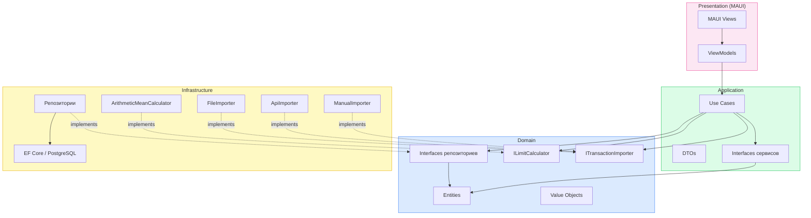
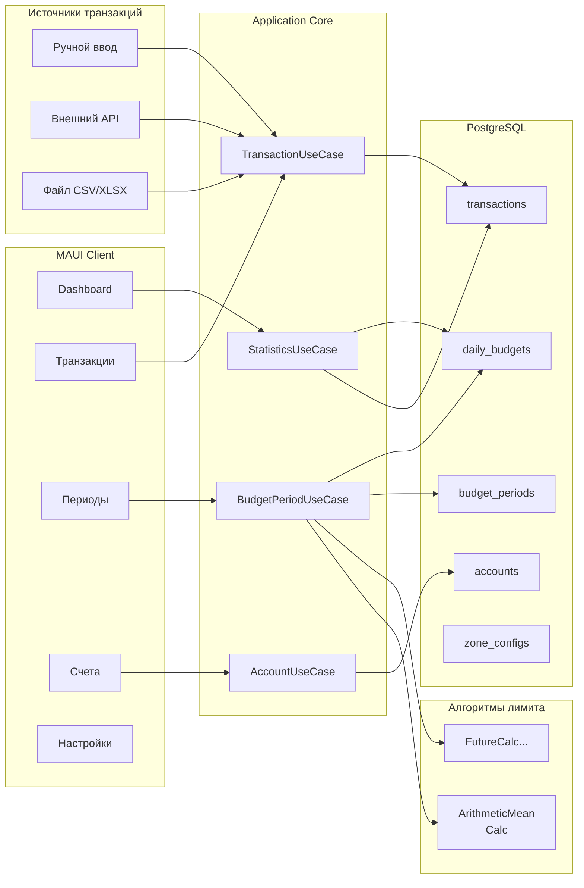
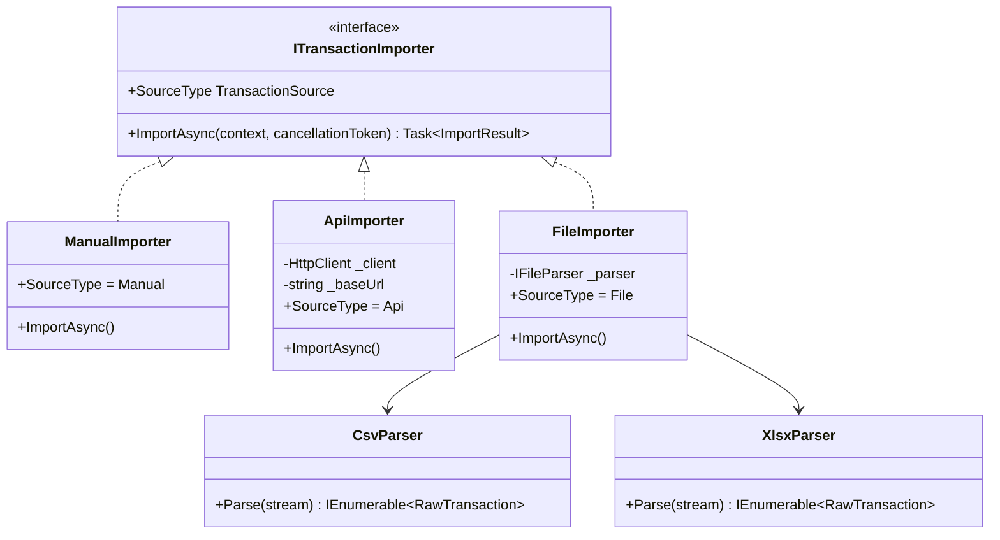
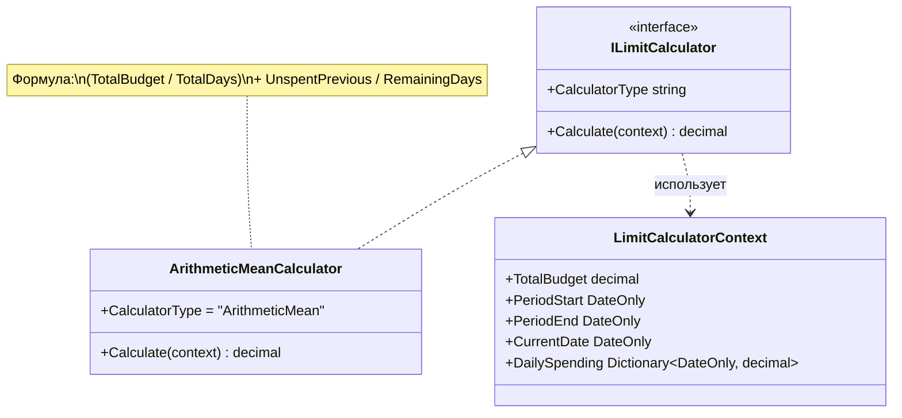
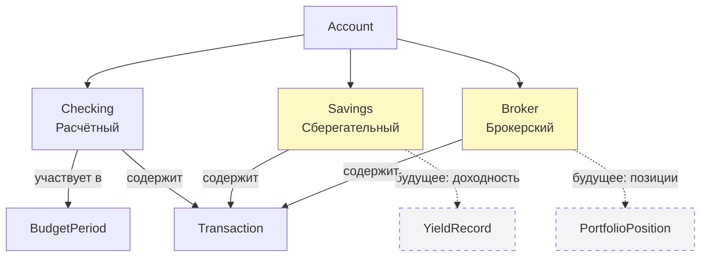
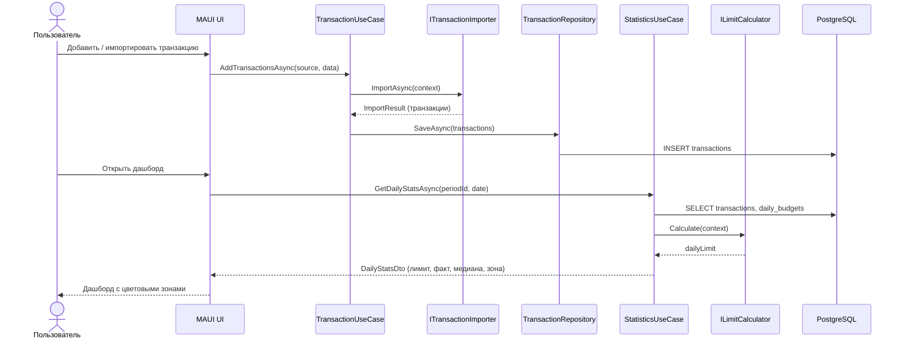

# Архитектура Dtoriki.BudjetMaster

**Платформа:** .NET 10 · MAUI · PostgreSQL · EF Core 10

[← Назад к README](../README.md)

---

## Содержание

- [Слои приложения](#слои-приложения)
- [Компонентная диаграмма](#компонентная-диаграмма)
- [Источники транзакций](#источники-транзакций)
- [Алгоритмы расчёта лимита](#алгоритмы-расчёта-лимита)
- [Типы счетов](#типы-счетов)
- [Поток данных](#поток-данных)

---

## Слои приложения

Проект построен по **Clean Architecture**: зависимости направлены строго внутрь — к слою Domain.



---

## Компонентная диаграмма



---

## Источники транзакций

Все каналы ввода реализуют единый интерфейс `ITransactionImporter`. Добавление нового канала (например, импорт из банка через Open Banking API) не затрагивает доменный слой.



---

## Алгоритмы расчёта лимита

Стратегия расчёта ежедневного лимита абстрагирована через `ILimitCalculator`. Первая реализация — `ArithmeticMeanCalculator`.



**Формула ArithmeticMeanCalculator:**

```
BaseLimit = TotalBudget / TotalDays
UnspentPrevious = Σ max(0, DailyLimit[d] - Spending[d])  для d < CurrentDate
RemainingDays = (PeriodEnd - CurrentDate).Days + 1

DailyLimit = BaseLimit + UnspentPrevious / RemainingDays
```

---

## Типы счетов

Тип счёта влияет на доступные операции и аналитику. Брокерские и сберегательные счета добавляются без изменения существующих сущностей.



---

## Поток данных

Полный цикл от ввода транзакции до отображения на дашборде.



---

*© Dtoriki.BudjetMaster — 2026.*
