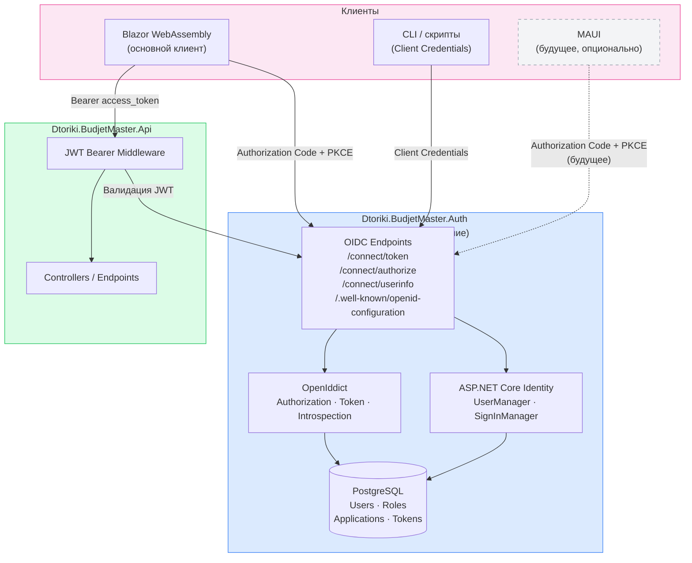
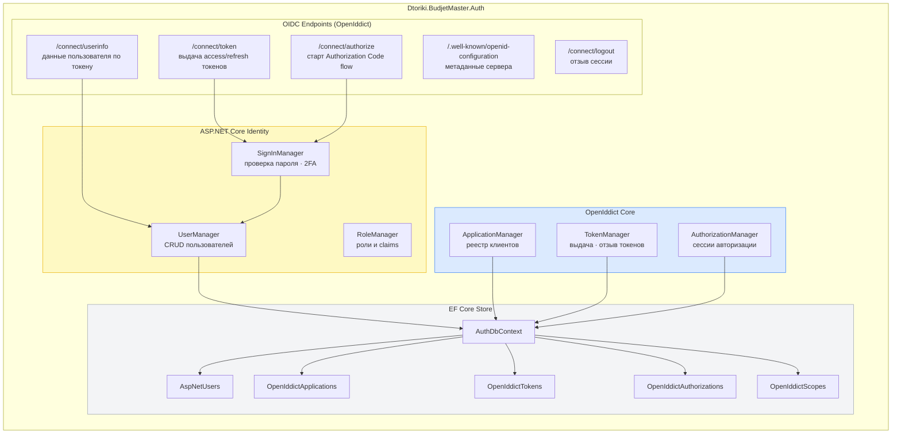
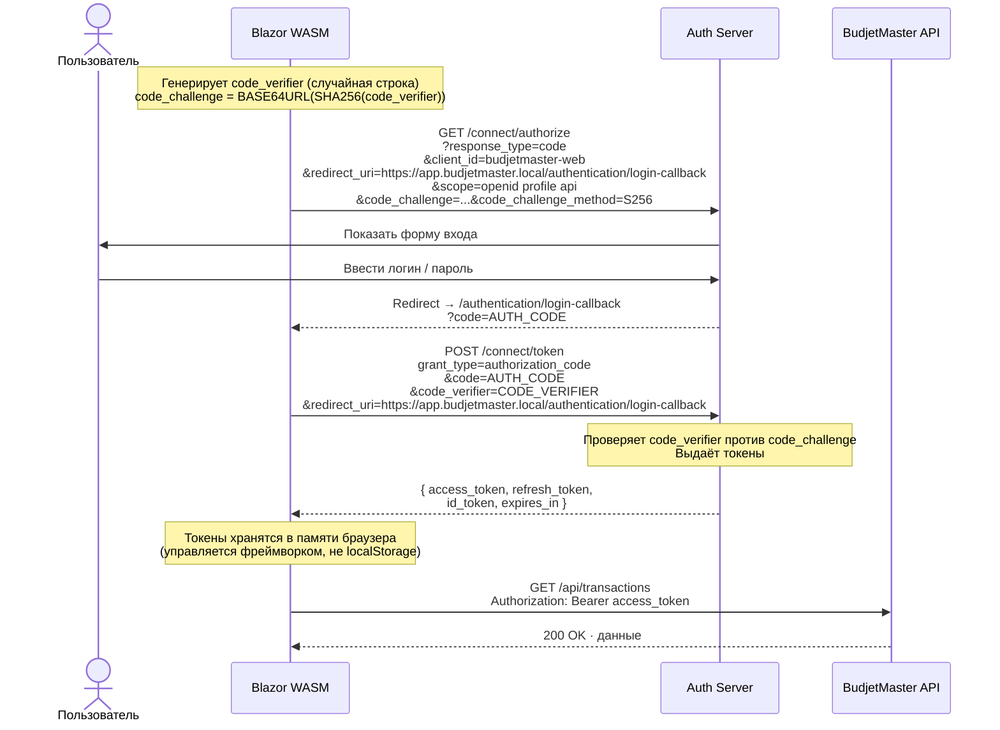
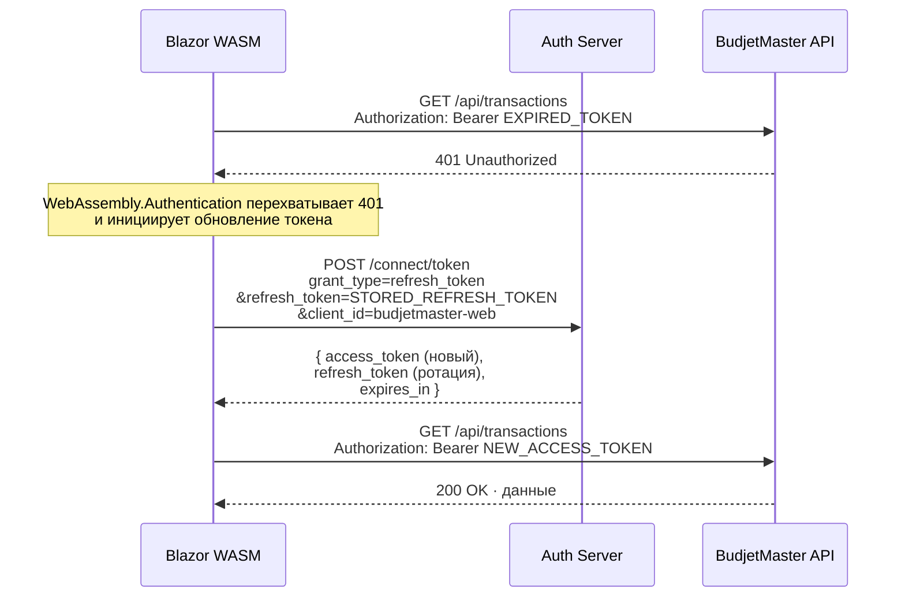
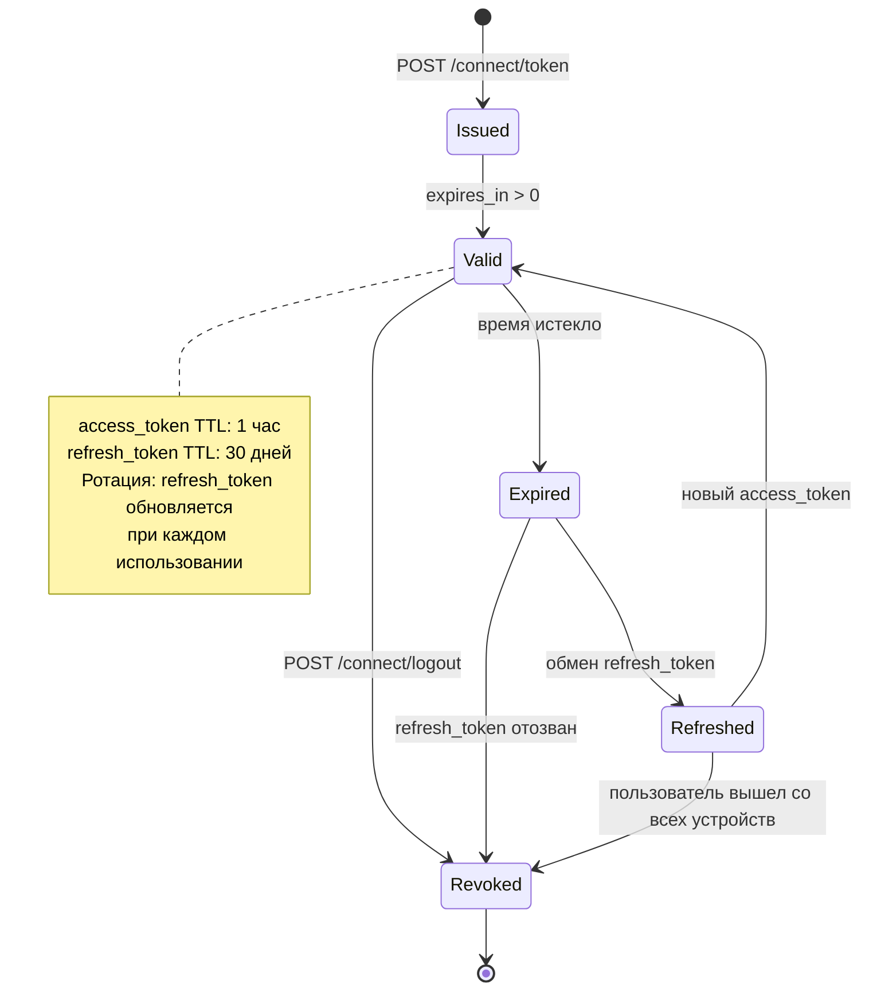
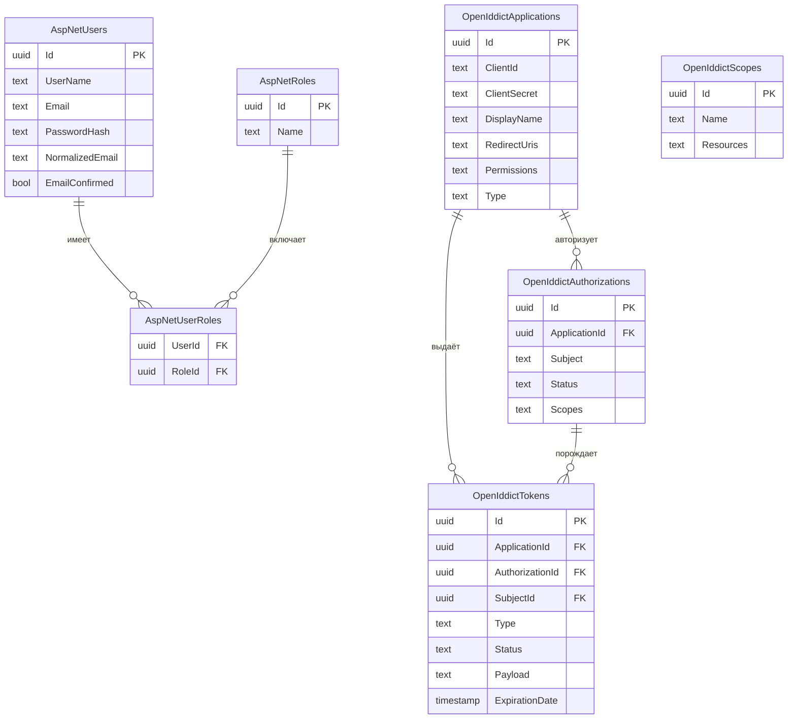
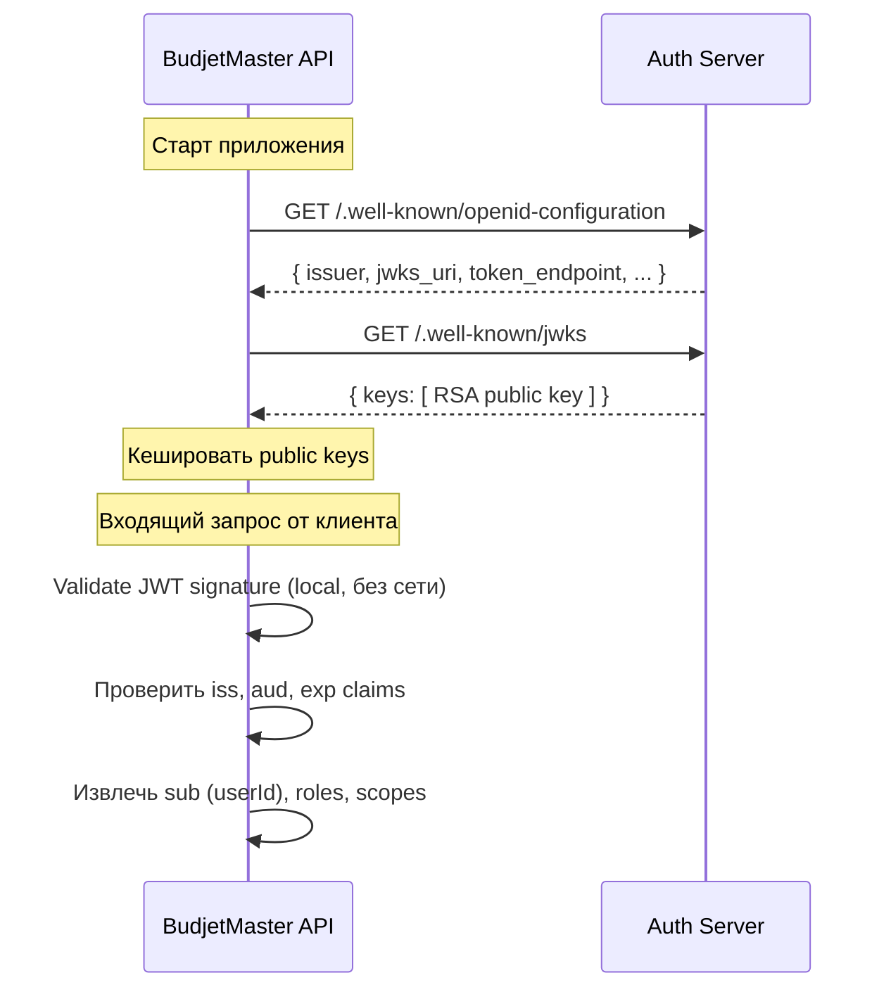

# Архитектура сервера авторизации — Dtoriki.BudjetMaster

**Платформа:** .NET 10 · ASP.NET Core Identity · OpenIddict · PostgreSQL

[← Назад к README](../../README.md)

---

## Содержание

- [Мотивация и цели](#мотивация-и-цели)
- [Стек технологий](#стек-технологий)
- [Обзор системы](#обзор-системы)
- [Компоненты auth-сервера](#компоненты-auth-сервера)
- [OAuth 2.0 / OIDC потоки](#oauth-20--oidc-потоки)
  - [Authorization Code + PKCE](#authorization-code--pkce)
  - [Refresh Token](#refresh-token)
- [Жизненный цикл токенов](#жизненный-цикл-токенов)
- [Структура проекта](#структура-проекта)
- [Схема базы данных](#схема-базы-данных)
- [Интеграция с API](#интеграция-с-api)
- [Конфигурация клиентов](#конфигурация-клиентов)
- [Ограничения и допущения](#ограничения-и-допущения)

---

## Мотивация и цели

Основной клиент BudjetMaster — Blazor WebAssembly. В будущем возможно подключение .NET MAUI
и сторонних интеграций. Все клиенты должны проходить аутентификацию через единую точку входа
без дублирования логики авторизации в каждом сервисе.

Цели auth-сервера:

- Единая точка выдачи токенов для всех клиентов (Blazor WASM, CLI, в будущем MAUI).
- Поддержка стандартных протоколов OAuth 2.0 + OpenID Connect.
- Управление пользователями через ASP.NET Core Identity.
- Масштабируемость: добавление нового клиента — только регистрация нового `client_id`.

---

## Стек технологий

| Компонент | Технология | Назначение |
|-----------|-----------|------------|
| Веб-клиент | Blazor WebAssembly (.NET 10) | Основной клиент |
| Фреймворк auth-сервера | ASP.NET Core 10 | Хост сервера авторизации |
| Управление пользователями | ASP.NET Core Identity | Хранение, хэши паролей, роли |
| OAuth 2.0 / OIDC сервер | OpenIddict 5.x | Выдача и валидация токенов |
| OIDC-клиент (WASM) | `Microsoft.AspNetCore.Components.WebAssembly.Authentication` | PKCE, хранение токенов |
| Хранилище | PostgreSQL + EF Core 10 | Пользователи, приложения, токены |
| Токены | JWT (access) + opaque (refresh) | Стандартные форматы |

---

## Обзор системы

Auth-сервер — отдельное ASP.NET Core-приложение. API-сервер и клиенты с ним не связаны
напрямую: они общаются только через стандартные OIDC-эндпоинты.



---

## Компоненты auth-сервера



---

## OAuth 2.0 / OIDC потоки

### Authorization Code + PKCE

Blazor WASM — публичный клиент. `client_secret` отсутствует, PKCE обязателен.
Библиотека `Microsoft.AspNetCore.Components.WebAssembly.Authentication` генерирует `code_verifier`
и управляет редиректами автоматически.



---

### Refresh Token

Когда `access_token` истёк, фреймворк Blazor WASM обменивает `refresh_token` автоматически,
прозрачно для компонентов. При обновлении страницы пользователь проходит повторную аутентификацию
(токены не сохраняются между сессиями браузера).



---

## Жизненный цикл токенов



---

## Структура проекта

```
src/
└── apps/
    ├── Dtoriki.BudjetMaster.Auth/          ← Auth Server (отдельное приложение)
    │   ├── Controllers/
    │   │   └── AuthorizationController.cs  ← обработка /connect/* эндпоинтов
    │   ├── Data/
    │   │   └── AuthDbContext.cs            ← Identity + OpenIddict таблицы
    │   ├── Models/
    │   │   └── ApplicationUser.cs          ← расширение IdentityUser
    │   ├── Seed/
    │   │   └── ClientSeeder.cs             ← регистрация клиентских приложений
    │   ├── appsettings.json
    │   └── Program.cs
    │
    ├── Dtoriki.BudjetMaster.Api/           ← Resource API (отдельное приложение)
    │   ├── Program.cs                      ← AddAuthentication().AddJwtBearer(...)
    │   └── ...
    │
    └── Dtoriki.BudjetMaster.Web/           ← Blazor WebAssembly (основной клиент)
        ├── Pages/
        ├── Shared/
        ├── wwwroot/
        ├── Program.cs                      ← AddOidcAuthentication(...)
        └── ...
```

---

## Схема базы данных

Auth-сервер использует отдельную PostgreSQL-базу (или отдельную схему `auth`).



---

## Интеграция с API

API-сервер не хранит пользователей — он только валидирует JWT, выданные auth-сервером.
Взаимодействие происходит через стандартный OIDC Discovery endpoint.



Конфигурация в `Program.cs` API-сервера:

```csharp
builder.Services.AddAuthentication(JwtBearerDefaults.AuthenticationScheme)
    .AddJwtBearer(options =>
    {
        options.Authority = "https://auth.budjetmaster.local";
        options.Audience  = "budjetmaster-api";
        options.TokenValidationParameters = new()
        {
            ValidateIssuer           = true,
            ValidateAudience         = true,
            ValidateLifetime         = true,
            ValidateIssuerSigningKey = true,
        };
    });
```

Конфигурация в `Program.cs` Blazor WASM:

```csharp
builder.Services.AddOidcAuthentication(options =>
{
    options.ProviderOptions.Authority    = "https://auth.budjetmaster.local";
    options.ProviderOptions.ClientId     = "budjetmaster-web";
    options.ProviderOptions.ResponseType = "code";
    options.ProviderOptions.DefaultScopes.Add("api");
});
```

---

## Конфигурация клиентов

Клиенты регистрируются через `ClientSeeder` при старте auth-сервера.

```csharp
// Blazor WASM — публичный клиент (без secret), Authorization Code + PKCE
await manager.CreateAsync(new OpenIddictApplicationDescriptor
{
    ClientId    = "budjetmaster-web",
    DisplayName = "BudjetMaster Web",
    ClientType  = ClientTypes.Public,
    RedirectUris =
    {
        new Uri("https://app.budjetmaster.local/authentication/login-callback"),
        new Uri("https://localhost:5001/authentication/login-callback"), // локальная отладка
    },
    PostLogoutRedirectUris =
    {
        new Uri("https://app.budjetmaster.local/authentication/logout-callback"),
    },
    Permissions =
    {
        Permissions.Endpoints.Authorization,
        Permissions.Endpoints.Token,
        Permissions.GrantTypes.AuthorizationCode,
        Permissions.GrantTypes.RefreshToken,
        Permissions.ResponseTypes.Code,
        Permissions.Scopes.OpenId,
        Permissions.Scopes.Profile,
        Permissions.Prefixes.Scope + "api",
    },
    Requirements = { Requirements.Features.ProofKeyForCodeExchange },
}, cancellationToken);

// Машинный клиент (CLI / фоновые задачи) — Client Credentials
await manager.CreateAsync(new OpenIddictApplicationDescriptor
{
    ClientId     = "budjetmaster-cli",
    ClientSecret = "<generated-secret>",
    DisplayName  = "BudjetMaster CLI",
    ClientType   = ClientTypes.Confidential,
    Permissions  =
    {
        Permissions.Endpoints.Token,
        Permissions.GrantTypes.ClientCredentials,
        Permissions.Prefixes.Scope + "api",
    },
}, cancellationToken);
```

---

## Ограничения и допущения

| Область | Ограничение |
|---------|------------|
| Implicit flow | Не используется — устарел в OAuth 2.1 |
| `client_secret` у Blazor WASM | Отсутствует — браузер не может безопасно хранить секрет |
| Хранение токенов | Управляется фреймворком в памяти браузера — не использовать `localStorage` напрямую (XSS) |
| Обновление страницы | Токены не переживают перезагрузку — пользователь повторно аутентифицируется (можно смягчить через silent refresh) |
| Несколько устройств / вкладок | Каждая сессия получает свой `refresh_token`; отзыв одного не влияет на остальные |
| 2FA | Не реализовано в первой фазе; `SignInManager` поддерживает расширение |
| Внешние провайдеры (Google, Apple) | Не реализовано; OpenIddict поддерживает через `AddGoogle()` / `AddApple()` |
| MAUI | Будущее; потребует регистрации отдельного `client_id` с redirect URI `budjetmaster://callback` |
| Отдельная БД | Auth-сервер использует отдельную базу (или схему `auth`) — не смешивать с бизнес-данными |

---

*© Dtoriki.BudjetMaster — 2026.*
