# Доменная модель Dtoriki.BudjetMaster

**Платформа:** .NET 10 · C# 13

[← Назад к README](../README.md)

---

## Содержание

- [Полная диаграмма классов](#полная-диаграмма-классов)
- [Сущности](#сущности)
- [Перечисления](#перечисления)
- [Value Objects](#value-objects)
- [Интерфейсы](#интерфейсы)
- [Инварианты и правила](#инварианты-и-правила)

---

## Полная диаграмма классов

```mermaid
classDiagram
    %% ─── Счета ───────────────────────────────────────────────
    class Account {
        +Guid Id
        +string Name
        +AccountType Type
        +string Currency
        +decimal CurrentBalance
    }

    class AccountType {
        <<enumeration>>
        Checking
        Savings
        Broker
    }

    %% ─── Транзакции ──────────────────────────────────────────
    class Transaction {
        +Guid Id
        +Guid AccountId
        +decimal Amount
        +TransactionType Type
        +TransactionSource Source
        +DateOnly Date
        +string? Description
    }

    class TransactionType {
        <<enumeration>>
        Income
        Expense
    }

    class TransactionSource {
        <<enumeration>>
        Manual
        Api
        File
    }

    %% ─── Периоды бюджета ─────────────────────────────────────
    class BudgetPeriod {
        +Guid Id
        +string Name
        +DateOnly StartDate
        +DateOnly EndDate
        +decimal TotalBudget
        +string LimitCalculatorType
    }

    class BudgetPeriodAccount {
        +Guid BudgetPeriodId
        +Guid AccountId
    }

    note for BudgetPeriodAccount "Таблица связи many-to-many.\nПериод может охватывать\nнесколько счетов."

    class DailyBudget {
        +Guid Id
        +Guid PeriodId
        +DateOnly Date
        +decimal CalculatedLimit
        +decimal ActualSpending
        +decimal Carryover
        +Guid? ActiveZoneId
    }

    %% ─── Зоны трат ───────────────────────────────────────────
    class SpendingZoneDefinition {
        +Guid Id
        +Guid PeriodId
        +string Name
        +string? Color
        +int Order
        +decimal? UpperThreshold
    }

    note for SpendingZoneDefinition "Зоны упорядочены по Order.\nUpperThreshold = null у последней зоны\n(перехватывает всё что выше).\n\nПример:\n  Order 1: Name='Зелёная'  Upper=0.40\n  Order 2: Name='Жёлтая'   Upper=0.60\n  Order 3: Name='Красная'  Upper=null"

    %% ─── Алгоритмы ───────────────────────────────────────────
    class ILimitCalculator {
        <<interface>>
        +string CalculatorType
        +Calculate(LimitCalculatorContext) decimal
    }

    class LimitCalculatorContext {
        +decimal TotalBudget
        +DateOnly PeriodStart
        +DateOnly PeriodEnd
        +DateOnly CurrentDate
        +Dictionary~DateOnly,decimal~ DailySpending
    }

    class ArithmeticMeanCalculator {
        +string CalculatorType = "ArithmeticMean"
        +Calculate(LimitCalculatorContext) decimal
    }

    %% ─── Импорт ──────────────────────────────────────────────
    class ITransactionImporter {
        <<interface>>
        +TransactionSource SourceType
        +ImportAsync(ImportContext, CancellationToken) Task~ImportResult~
    }

    class ImportResult {
        +Transaction[] Transactions
        +int FailedCount
        +string[] Errors
    }

    %% ─── Статистика (read-model) ─────────────────────────────
    class DailyStatsDto {
        <<DTO>>
        +DateOnly Date
        +decimal DailyLimit
        +decimal ActualSpending
        +decimal Median
        +decimal DeviationFromMedian
        +string? ZoneName
        +string? ZoneColor
    }

    %% ─── Связи ───────────────────────────────────────────────
    Account "many" <--> "many" BudgetPeriod : BudgetPeriodAccount
    Account "1" --> "many" Transaction : содержит

    BudgetPeriod "1" --> "many" DailyBudget : включает
    BudgetPeriod "1" --> "many" SpendingZoneDefinition : определяет зоны

    DailyBudget "many" --> "0..1" SpendingZoneDefinition : ActiveZoneId

    Account --> AccountType
    Transaction --> TransactionType
    Transaction --> TransactionSource

    ILimitCalculator <|.. ArithmeticMeanCalculator
    ILimitCalculator ..> LimitCalculatorContext : принимает
    BudgetPeriod ..> ILimitCalculator : использует по LimitCalculatorType

    ITransactionImporter ..> ImportResult : возвращает
    ITransactionImporter --> TransactionSource
```



---

## Сущности

### Account

Счёт пользователя. Один счёт может участвовать в нескольких расчётных периодах.

| Поле | Тип | Описание |
|------|-----|----------|
| `Id` | `Guid` | Идентификатор |
| `Name` | `string` | Название счёта |
| `Type` | `AccountType` | Тип: расчётный / сберегательный / брокерский |
| `Currency` | `string` | ISO 4217 (например, `RUB`, `USD`) |
| `CurrentBalance` | `decimal` | Текущий баланс |

### Transaction

Финансовая операция (доход или расход), привязанная к конкретному счёту.

| Поле | Тип | Описание |
|------|-----|----------|
| `Id` | `Guid` | Идентификатор |
| `AccountId` | `Guid` | FK → Account |
| `Amount` | `decimal` | Сумма (всегда положительная) |
| `Type` | `TransactionType` | `Income` / `Expense` |
| `Source` | `TransactionSource` | Канал ввода |
| `Date` | `DateOnly` | Дата операции |
| `Description` | `string?` | Комментарий |

### BudgetPeriod

Расчётный период с бюджетом, охватывающий один или несколько счетов.
Связь со счетами — many-to-many через `BudgetPeriodAccount`.

| Поле | Тип | Описание |
|------|-----|----------|
| `Id` | `Guid` | Идентификатор |
| `Name` | `string` | Название периода |
| `StartDate` | `DateOnly` | Дата начала |
| `EndDate` | `DateOnly` | Дата окончания |
| `TotalBudget` | `decimal` | Общий бюджет периода |
| `LimitCalculatorType` | `string` | Тип алгоритма (`"ArithmeticMean"`, ...) |

### BudgetPeriodAccount

Таблица связи many-to-many между `BudgetPeriod` и `Account`.

| Поле | Тип | Описание |
|------|-----|----------|
| `BudgetPeriodId` | `Guid` | FK → BudgetPeriod |
| `AccountId` | `Guid` | FK → Account |

### DailyBudget

Ежедневный лимит и факт трат за один день периода. `ActualSpending` агрегирует расходы по всем счетам периода за этот день.

| Поле | Тип | Описание |
|------|-----|----------|
| `Id` | `Guid` | Идентификатор |
| `PeriodId` | `Guid` | FK → BudgetPeriod |
| `Date` | `DateOnly` | День |
| `CalculatedLimit` | `decimal` | Расчётный лимит дня |
| `ActualSpending` | `decimal` | Фактические траты по всем счетам периода |
| `Carryover` | `decimal` | Перенесённый остаток с предыдущих дней |
| `ActiveZoneId` | `Guid?` | FK → SpendingZoneDefinition (определяется при пересчёте) |

### SpendingZoneDefinition

Одна зона трат в наборе зон расчётного периода. Зоны упорядочены по `Order`; зона применяется, если `ratio ≤ UpperThreshold` (или она последняя).

| Поле | Тип | Описание |
|------|-----|----------|
| `Id` | `Guid` | Идентификатор |
| `PeriodId` | `Guid` | FK → BudgetPeriod |
| `Name` | `string` | Произвольное название зоны |
| `Color` | `string?` | Цвет в HEX или CSS-имени (опционально) |
| `Order` | `int` | Порядок зоны (по возрастанию порога) |
| `UpperThreshold` | `decimal?` | Верхняя граница как доля от лимита; `null` у последней зоны |

Алгоритм определения зоны:

```
ratio = ActualSpending / CalculatedLimit

zones = SpendingZoneDefinitions
    .OrderBy(z => z.Order)

activeZone = zones.FirstOrDefault(z => z.UpperThreshold == null
                                    || ratio <= z.UpperThreshold)
```

Пример конфигурации по умолчанию (три зоны):

| Order | Name | UpperThreshold |
|-------|------|---------------|
| 1 | Зелёная | 0.40 |
| 2 | Жёлтая | 0.60 |
| 3 | Красная | `null` |

Пример расширенной конфигурации (пять зон):

| Order | Name | UpperThreshold |
|-------|------|---------------|
| 1 | Отличный результат | 0.20 |
| 2 | Норма | 0.50 |
| 3 | Внимание | 0.75 |
| 4 | Перерасход | 1.00 |
| 5 | Критично | `null` |

---

## Перечисления

### AccountType

- `Checking` — расчётный счёт (основной тип для бюджетирования).
- `Savings` — сберегательный счёт (будущая функциональность: доходность).
- `Broker` — брокерский счёт (будущая функциональность: портфель).

### TransactionType

- `Income` — поступление средств.
- `Expense` — списание средств.

### TransactionSource

- `Manual` — ввод вручную пользователем.
- `Api` — импорт из внешнего API (банк, агрегатор).
- `File` — загрузка из файла (CSV, XLSX).

---

## Value Objects

### LimitCalculatorContext

Контекст, передаваемый в `ILimitCalculator.Calculate()`. Не является сущностью БД.

| Поле | Тип | Описание |
|------|-----|----------|
| `TotalBudget` | `decimal` | Общий бюджет периода |
| `PeriodStart` | `DateOnly` | Начало периода |
| `PeriodEnd` | `DateOnly` | Конец периода |
| `CurrentDate` | `DateOnly` | Дата, для которой считается лимит |
| `DailySpending` | `Dictionary<DateOnly, decimal>` | Факт трат по дням до текущей даты (агрегировано по всем счетам периода) |

---

## Интерфейсы

### ILimitCalculator

Стратегия расчёта ежедневного лимита.

- `string CalculatorType` — идентификатор стратегии, хранится в `BudgetPeriod.LimitCalculatorType`.
- `decimal Calculate(LimitCalculatorContext context)` — возвращает лимит на текущий день.

**ArithmeticMeanCalculator** — первая реализация:

```
BaseLimit     = TotalBudget / TotalDays
Unspent       = Σ max(0, DailyLimit[d] - Spending[d])  для d < CurrentDate
RemainingDays = (PeriodEnd - CurrentDate).Days + 1

DailyLimit    = BaseLimit + Unspent / RemainingDays
```

### ITransactionImporter

Канал импорта транзакций.

- `TransactionSource SourceType` — тип источника.
- `Task<ImportResult> ImportAsync(ImportContext context, CancellationToken cancellationToken)` — выполняет импорт и возвращает результат с ошибками.

---

## Инварианты и правила

| Область | Условие | Гарантия |
|---------|---------|----------|
| `Transaction.Amount` | > 0 | Знак определяется через `TransactionType` |
| `BudgetPeriod` | `StartDate` < `EndDate` | Период не может быть нулевым |
| `SpendingZoneDefinition` | Зоны упорядочены, ровно одна имеет `UpperThreshold = null` | Контролируется при сохранении на уровне Application |
| `SpendingZoneDefinition` | Пороги строго возрастают по `Order` | Контролируется при сохранении на уровне Application |
| `DailyBudget` | Одна запись на день в пределах периода | Уникальный индекс `(PeriodId, Date)` |
| `BudgetPeriodAccount` | Счёт добавлен в период не более одного раза | Составной PK `(BudgetPeriodId, AccountId)` |
| `DailyBudget.ActualSpending` | Агрегирует расходы по всем счетам периода | Пересчитывается при добавлении транзакции к любому из счетов |

---

*© Dtoriki.BudjetMaster — 2026.*
