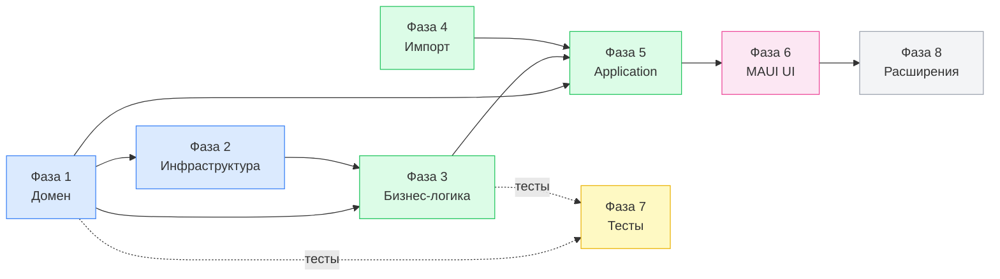
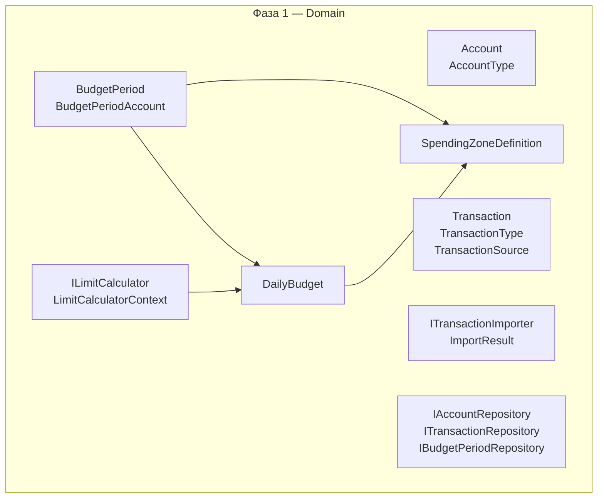
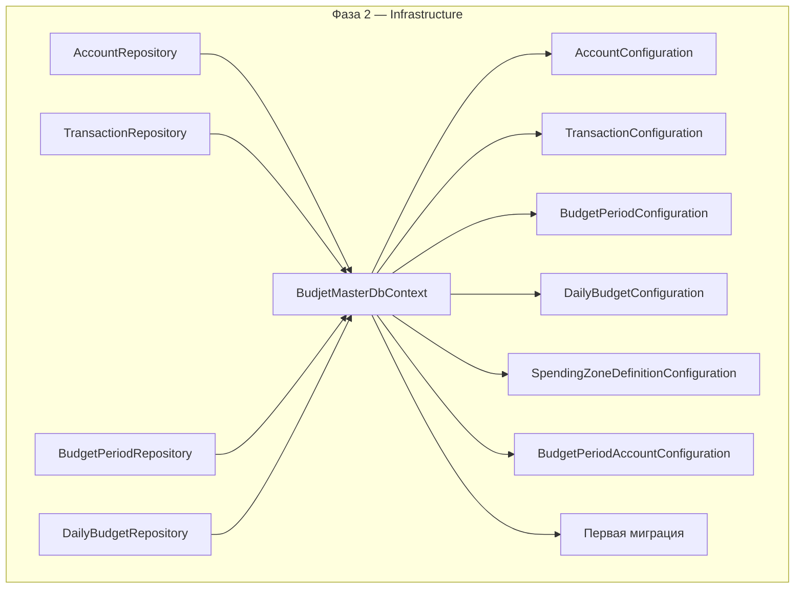
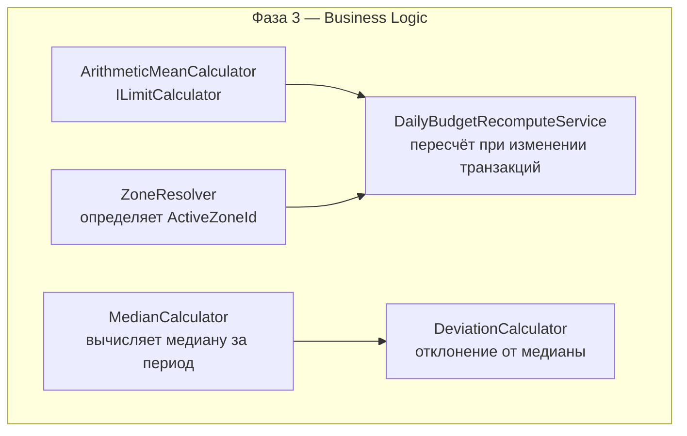
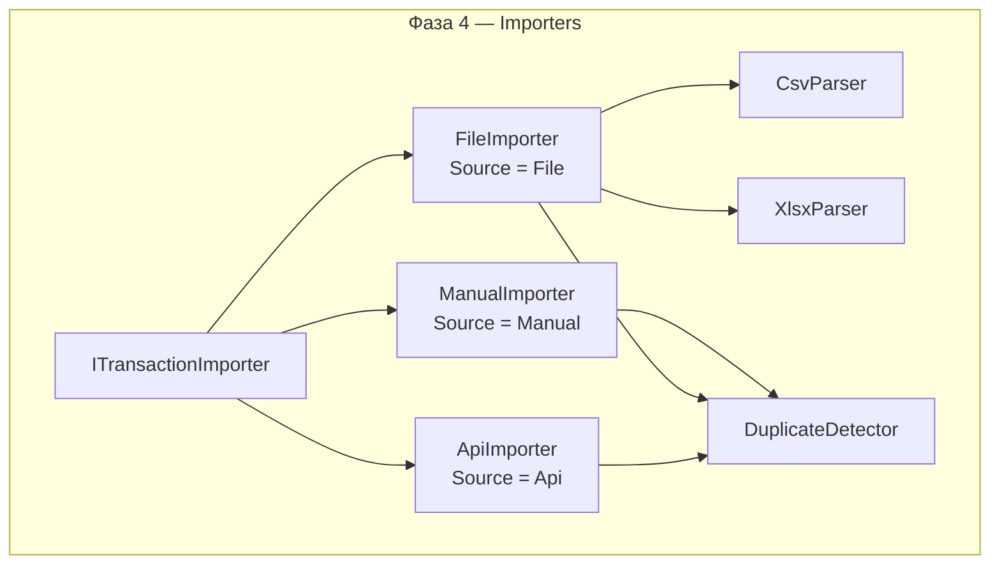
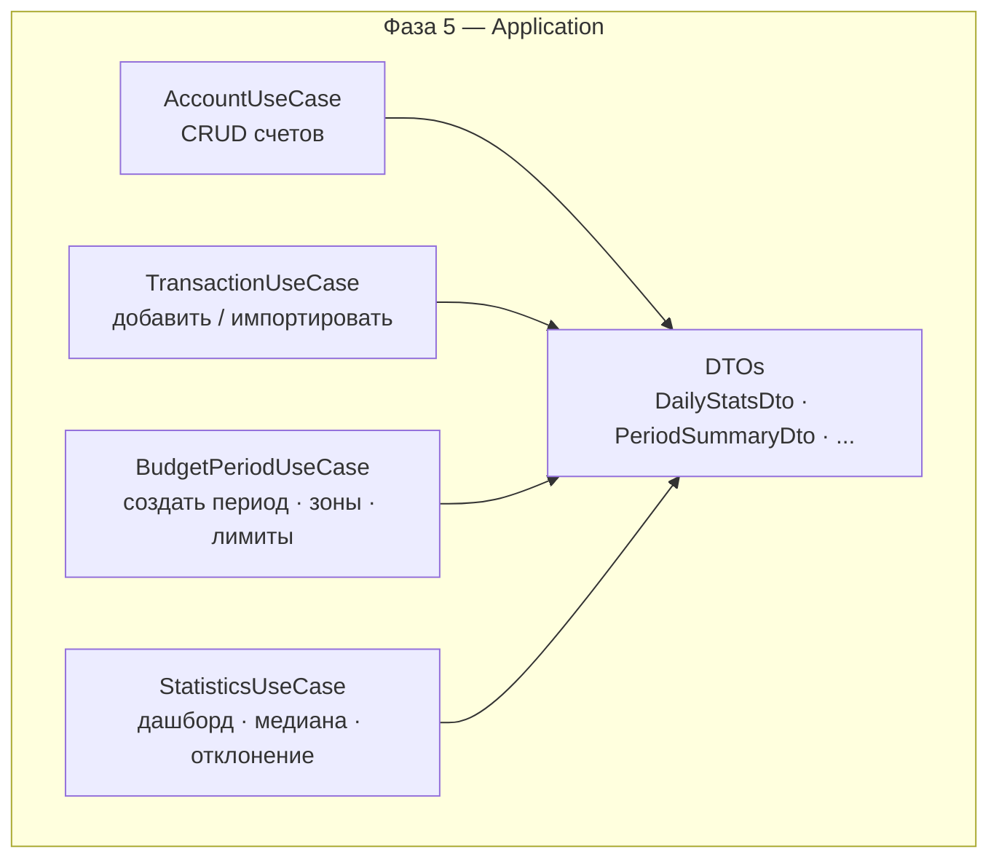
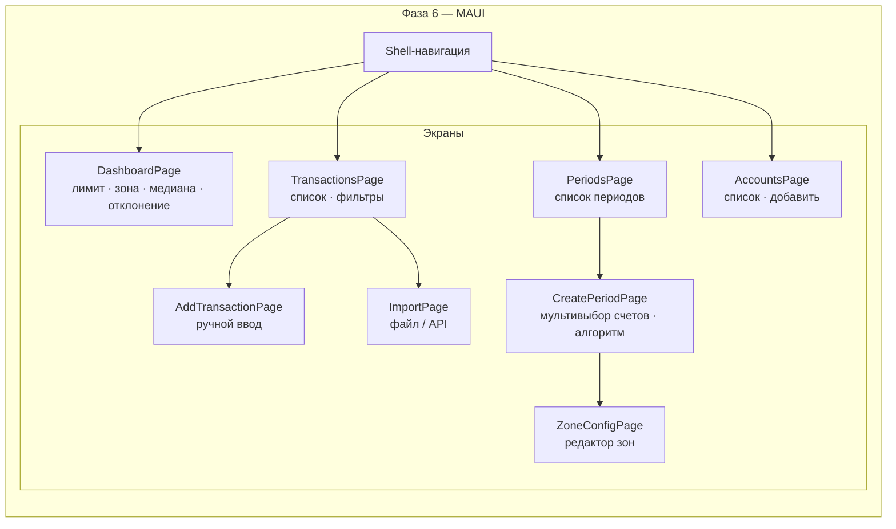
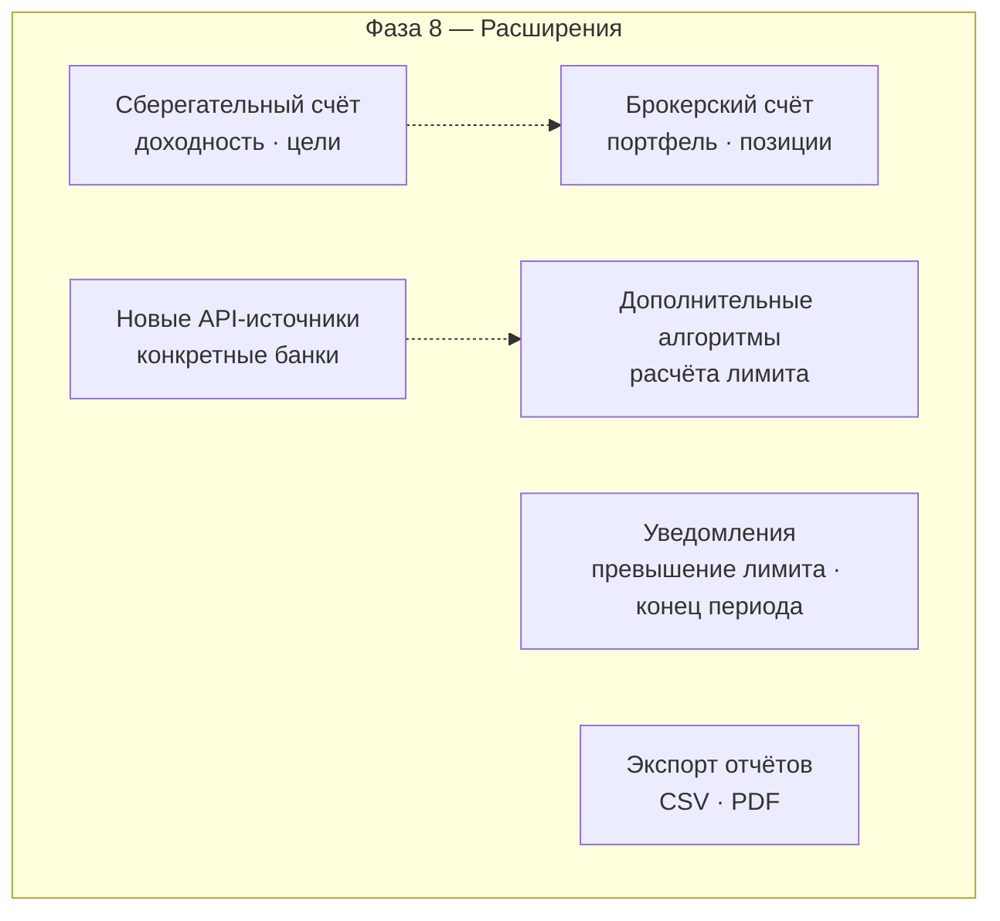
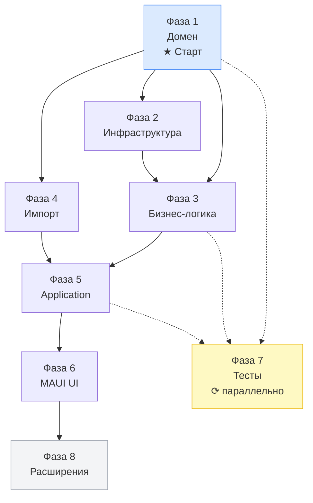

# План реализации Dtoriki.BudjetMaster

[← Назад к README](../README.md)

---

## Содержание

- [Обзор фаз](#обзор-фаз)
- [Фаза 1 — Доменный слой](#фаза-1--доменный-слой)
- [Фаза 2 — Инфраструктура и БД](#фаза-2--инфраструктура-и-бд)
- [Фаза 3 — Бизнес-логика](#фаза-3--бизнес-логика)
- [Фаза 4 — Импорт транзакций](#фаза-4--импорт-транзакций)
- [Фаза 5 — Application слой](#фаза-5--application-слой)
- [Фаза 6 — MAUI UI](#фаза-6--maui-ui)
- [Фаза 7 — Тесты](#фаза-7--тесты)
- [Фаза 8 — Расширения](#фаза-8--расширения)
- [Зависимости между фазами](#зависимости-между-фазами)

---

## Обзор фаз

```mermaid
gantt
    title Очерёдность реализации BudjetMaster
    dateFormat  X
    axisFormat  Фаза %s

    section Ядро
    Доменный слой          :done,    f1, 1, 2
    Инфраструктура и БД    :active,  f2, 2, 3
    Бизнес-логика          :         f3, 3, 4

    section Данные
    Импорт транзакций      :         f4, 4, 5
    Application слой       :         f5, 3, 5

    section UI
    MAUI UI                :         f6, 5, 7

    section Качество
    Тесты                  :         f7, 1, 7

    section Будущее
    Расширения             :         f8, 7, 9
```

---

## Фаза 1 — Доменный слой

**Приоритет:** первый. Всё остальное зависит от домена.

Цель — описать сущности, value objects и интерфейсы без какой-либо зависимости от инфраструктуры или UI.

Задачи:

- Создать проект `Dtoriki.BudjetMaster.Domain`.
- Реализовать сущности: `Account`, `Transaction`, `BudgetPeriod`, `BudgetPeriodAccount`, `DailyBudget`, `SpendingZoneDefinition`.
- Объявить перечисления: `AccountType`, `TransactionType`, `TransactionSource`.
- Объявить интерфейсы: `ILimitCalculator`, `ITransactionImporter`.
- Объявить интерфейсы репозиториев: `IAccountRepository`, `ITransactionRepository`, `IBudgetPeriodRepository`, `IDailyBudgetRepository`.
- Покрыть инварианты XML-документацией.

---

## Фаза 2 — Инфраструктура и БД

**Зависит от:** Фазы 1.

Цель — подключить PostgreSQL через EF Core, реализовать репозитории, создать миграции.

Задачи:

- Создать проект `Dtoriki.BudjetMaster.Infrastructure`.
- Настроить `BudjetMasterDbContext` с конфигурациями всех сущностей.
- Реализовать репозитории (`IAccountRepository`, `ITransactionRepository`, `IBudgetPeriodRepository`, `IDailyBudgetRepository`).
- Настроить уникальные индексы: `(PeriodId, Date)` для `DailyBudget`, `(BudgetPeriodId, AccountId)` для `BudgetPeriodAccount`.
- Создать первую миграцию и применить к PostgreSQL.
- Добавить seed-данные для ручного тестирования.

---

## Фаза 3 — Бизнес-логика

**Зависит от:** Фаз 1 и 2.

Цель — реализовать расчёт лимитов, зон и статистики.

Задачи:

- Реализовать `ArithmeticMeanCalculator` (формула: `BaseLimit + Unspent / RemainingDays`).
- Реализовать `ZoneResolver` — определяет `SpendingZoneDefinition` для заданного `ratio`.
- Реализовать `MedianCalculator` — медиана трат за все дни периода до текущей даты.
- Реализовать `DeviationCalculator` — отклонение факта от медианы в абсолютном и процентном выражении.
- Реализовать `DailyBudgetRecomputeService` — пересчитывает `CalculatedLimit`, `Carryover`, `ActiveZoneId` при добавлении/изменении транзакции.

---

## Фаза 4 — Импорт транзакций

**Зависит от:** Фазы 1. Может реализовываться параллельно с Фазой 3.

Цель — подключить внешние каналы ввода транзакций.

Задачи:

- Реализовать `ManualImporter` (оборачивает одиночный ввод в `ImportResult`).
- Реализовать `CsvParser` и `XlsxParser`.
- Реализовать `FileImporter` с поддержкой CSV и XLSX.
- Реализовать заготовку `ApiImporter` (интерфейс + HTTP-клиент, конкретные источники добавляются позже).
- Реализовать `DuplicateDetector` — проверка по `(AccountId, Date, Amount, Type)`.

---

## Фаза 5 — Application слой

**Зависит от:** Фаз 1, 3 и 4.

Цель — оркестрировать бизнес-логику и репозитории через use-cases; подготовить DTOs для UI.

Задачи:

- Создать проект `Dtoriki.BudjetMaster.Application`.
- Реализовать `AccountUseCase`: создание, обновление, получение счетов.
- Реализовать `TransactionUseCase`: добавление одиночной транзакции, импорт пакета, список с фильтрацией.
- Реализовать `BudgetPeriodUseCase`: создание периода с мультивыбором счетов, настройка зон, пересчёт при изменениях.
- Реализовать `StatisticsUseCase`: `DailyStatsDto` (лимит, факт, медиана, отклонение, зона), `PeriodSummaryDto`.
- Зарегистрировать зависимости (DI).

---

## Фаза 6 — MAUI UI

**Зависит от:** Фазы 5.

Цель — реализовать пользовательский интерфейс на .NET MAUI по паттерну MVVM.

Задачи:

- Создать проект `Dtoriki.BudjetMaster.Maui`.
- Настроить Shell-навигацию.
- Реализовать `DashboardPage` + `DashboardViewModel`: цветовая зона, лимит, факт, медиана, отклонение, мини-график по дням.
- Реализовать `TransactionsPage` + фильтры по дате / счёту / типу.
- Реализовать `AddTransactionPage` (ручной ввод).
- Реализовать `ImportPage`: выбор файла или настройка API.
- Реализовать `PeriodsPage` + `CreatePeriodPage` (мультивыбор счетов).
- Реализовать `ZoneConfigPage`: добавление / удаление / редактирование зон.
- Реализовать `AccountsPage`.

---

## Фаза 7 — Тесты

**Ведётся параллельно** с каждой фазой. Тесты пишутся сразу после реализации.

| Что тестируется | Тип | Фреймворк |
|-----------------|-----|-----------|
| Доменные инварианты | Unit | xUnit |
| `ArithmeticMeanCalculator` | Unit | xUnit |
| `ZoneResolver` | Unit | xUnit |
| `MedianCalculator`, `DeviationCalculator` | Unit | xUnit |
| `DailyBudgetRecomputeService` | Unit | xUnit + Moq |
| `DuplicateDetector` | Unit | xUnit |
| Use-cases | Unit | xUnit + Moq |
| Репозитории | Integration | xUnit + Testcontainers (PostgreSQL) |
| Импортеры (CSV/XLSX) | Unit | xUnit |

Задачи:

- Создать `tests/Directory.Build.props` с общими зависимостями (xUnit, Moq, coverlet).
- Создать тестовые проекты для каждого слоя: `Domain.Tests`, `Application.Tests`, `Infrastructure.Tests`.
- Настроить `InternalsVisibleTo` там, где нужно тестировать `internal`-члены.
- Настроить Testcontainers для интеграционных тестов репозиториев.
- Настроить покрытие (coverlet + отчёт).

---

## Фаза 8 — Расширения

**После** завершения основного функционала (Фазы 1–7).

Задачи:

- Реализовать `AccountType.Savings`: учёт доходности, цели накопления.
- Реализовать `AccountType.Broker`: портфель, позиции, P&L.
- Добавить конкретные реализации `ApiImporter` для популярных банков.
- Добавить альтернативные `ILimitCalculator` (например, взвешенный по дням недели).
- Добавить push-уведомления при превышении лимита или окончании периода.
- Добавить экспорт статистики в CSV и PDF.

---

## Зависимости между фазами

Фазы 3 и 4 могут реализовываться параллельно, так как не зависят друг от друга.
Тесты (Фаза 7) пишутся по мере реализации каждой фазы — не откладываются в конец.

---

*© Dtoriki.BudjetMaster — 2026.*
