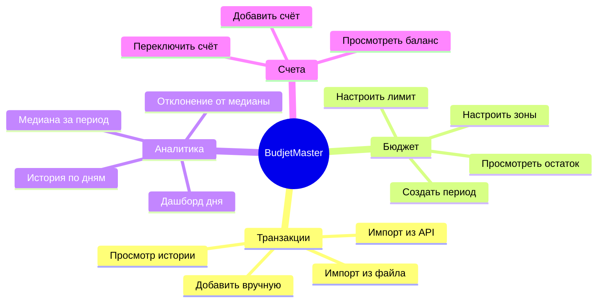
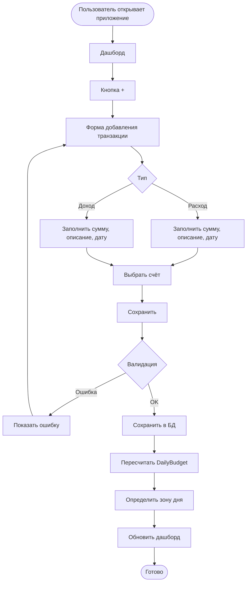
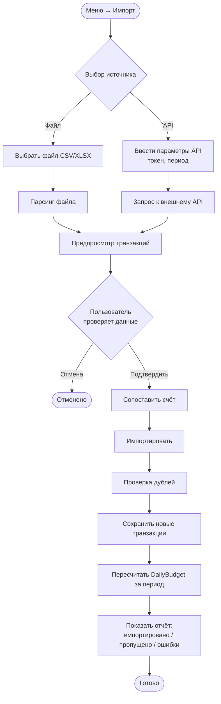
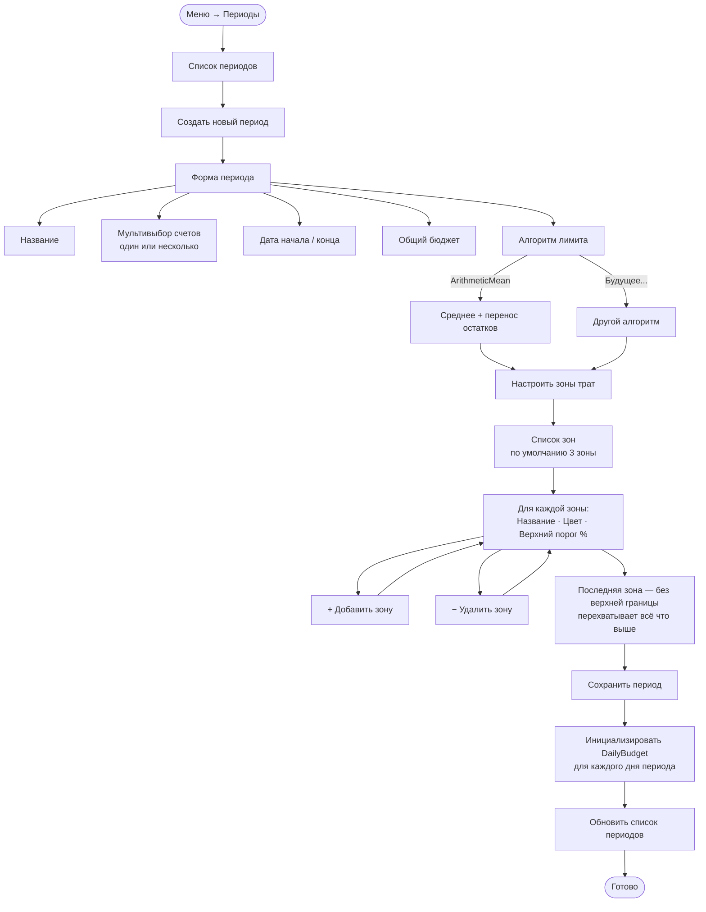
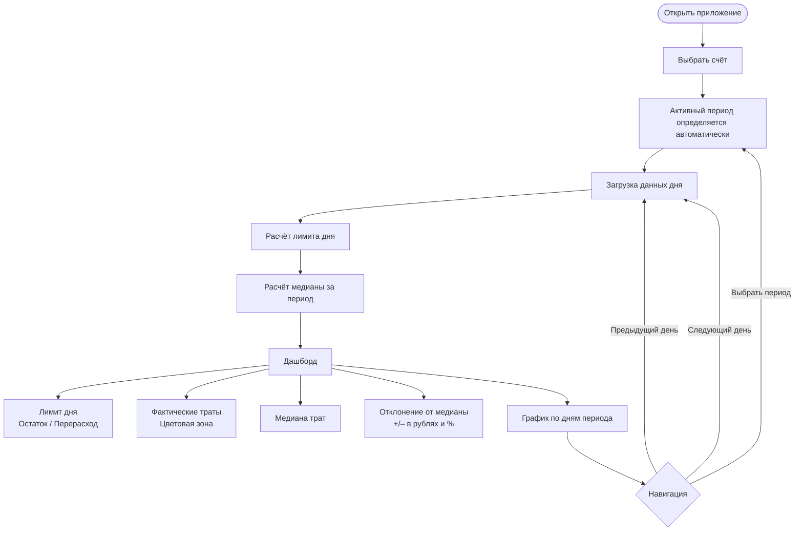
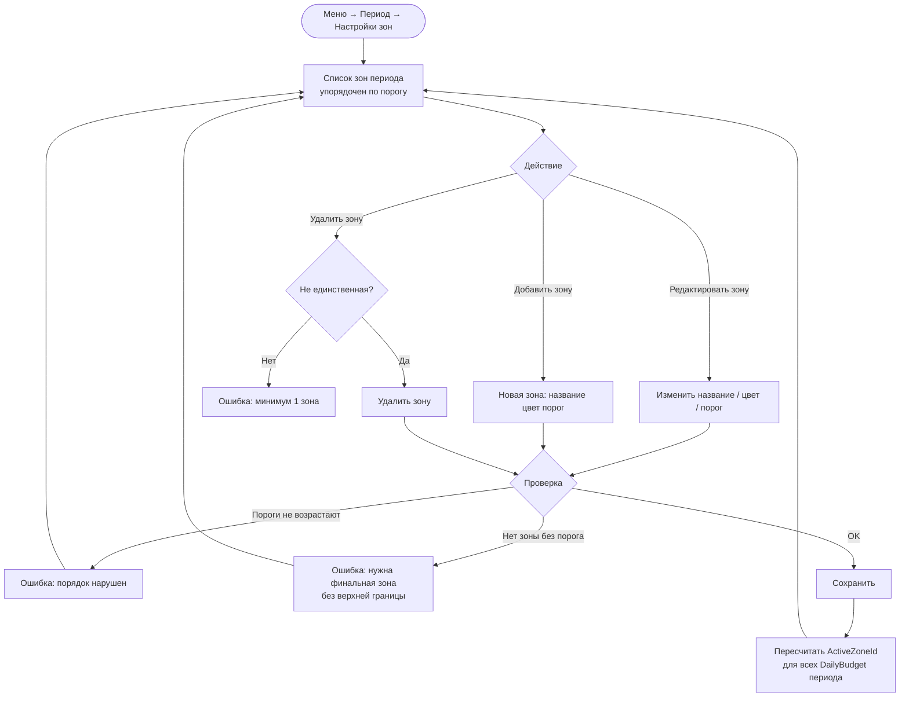
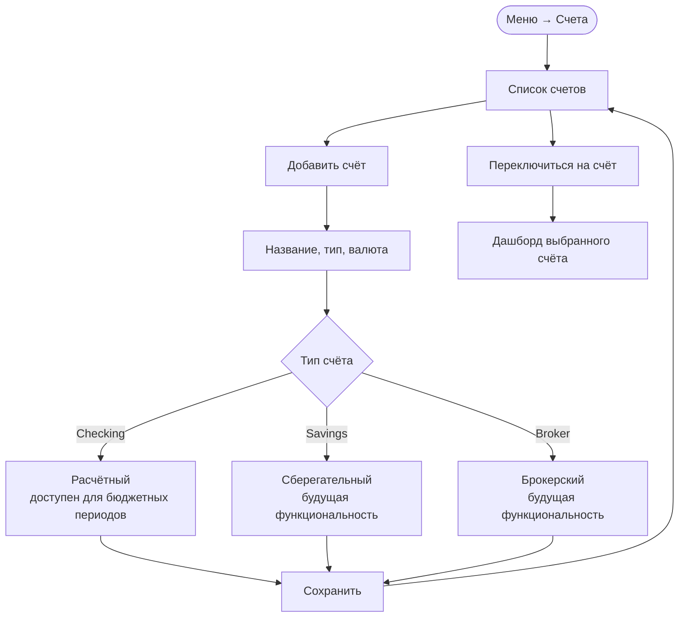
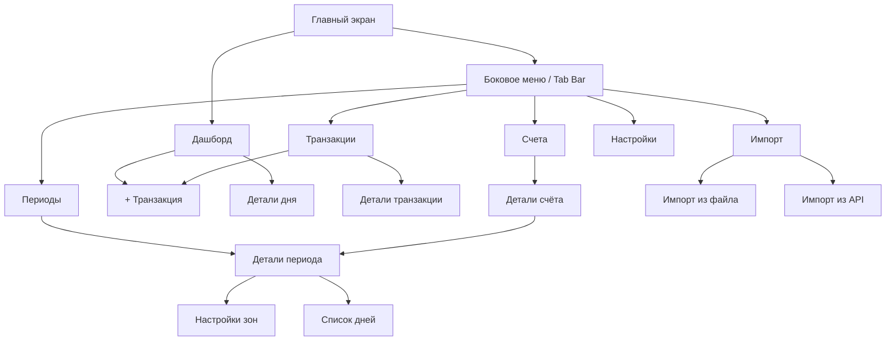

# Пользовательские сценарии Dtoriki.BudjetMaster

[← Назад к README](../README.md)

---

## Содержание

- [Основные сценарии](#основные-сценарии)
- [Добавление транзакции](#добавление-транзакции)
- [Импорт транзакций из файла или API](#импорт-транзакций-из-файла-или-api)
- [Создание расчётного периода](#создание-расчётного-периода)
- [Просмотр дашборда](#просмотр-дашборда)
- [Настройка зон трат](#настройка-зон-трат)
- [Управление счетами](#управление-счетами)
- [Навигация по приложению](#навигация-по-приложению)

---

## Основные сценарии

---

## Добавление транзакции

Ручной ввод — основной быстрый способ фиксации расхода или дохода.

---

## Импорт транзакций из файла или API

---

## Создание расчётного периода

---

## Просмотр дашборда

---

## Настройка зон трат

Зоны можно изменить в рамках уже созданного периода. Число зон не ограничено.

---

## Управление счетами

---

## Навигация по приложению

Общая структура навигации MAUI-приложения.

---

*© Dtoriki.BudjetMaster — 2026.*
