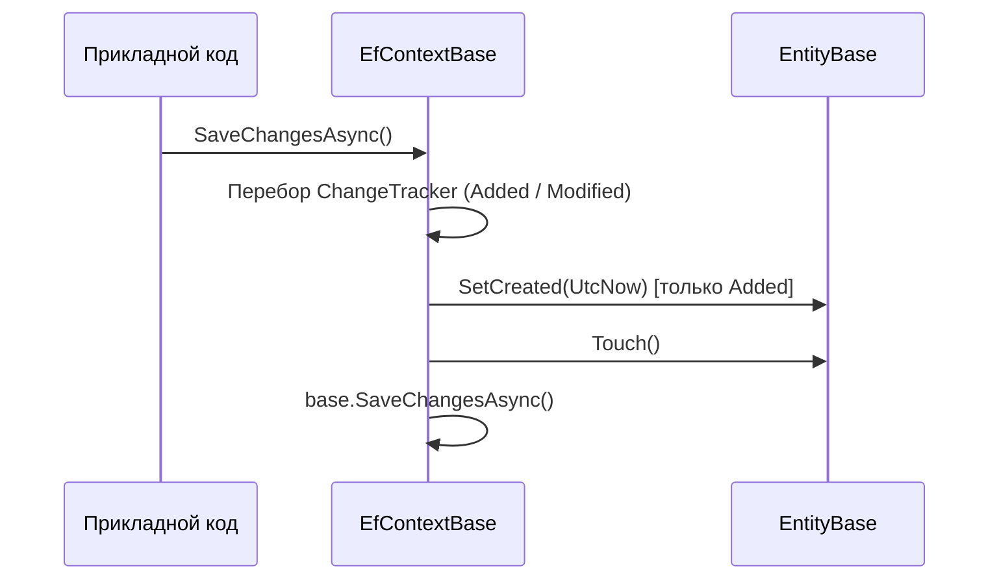
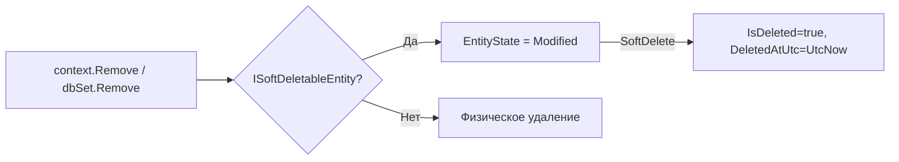
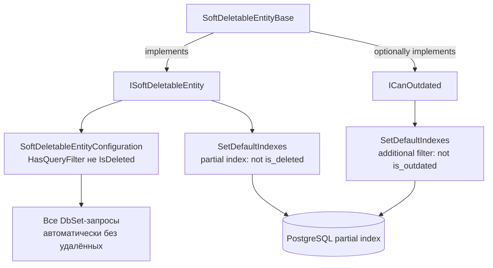
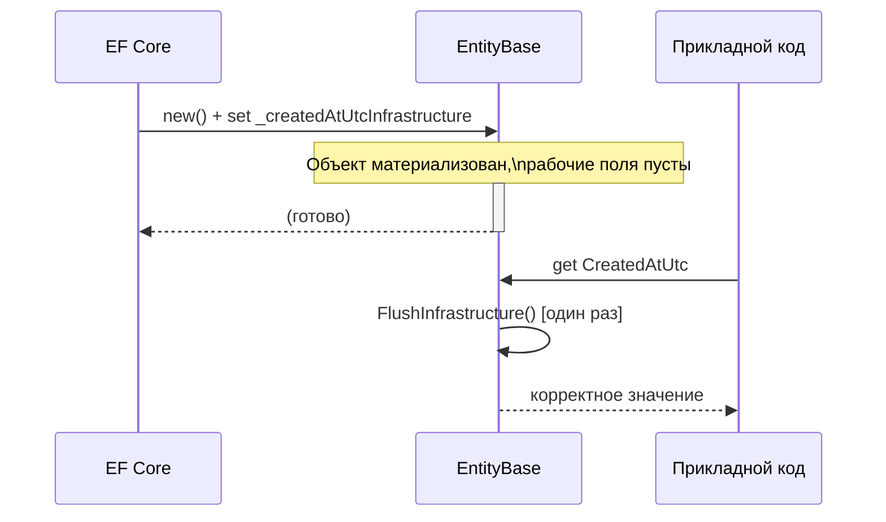

# Dtoriki.Data.Core

**Платформа:** .NET 10 · [EntityFrameworkCore](https://www.nuget.org/packages/Microsoft.EntityFrameworkCore) · [EntityFrameworkCore.Relational](https://www.nuget.org/packages/Microsoft.EntityFrameworkCore.Relational) · [Microsoft.Extensions.DependencyInjection.Abstractions](https://www.nuget.org/packages/Microsoft.Extensions.DependencyInjection.Abstractions) · [Microsoft.Extensions.Configuration](https://www.nuget.org/packages/Microsoft.Extensions.Configuration)

[← Свод кодовой базы](../../docs/src/README.md)

---

## Содержание

- [Назначение](#назначение)
- [Публичный API](#публичный-api)
- [Взаимодействия типов](#взаимодействия-типов)
- [Инварианты и правила](#инварианты-и-правила)
- [Сценарии использования](#сценарии-использования)
- [Обработка ошибок](#обработка-ошибок)
- [Ограничения и допущения](#ограничения-и-допущения)
- [Покрытие тестами](#покрытие-тестами)
- [Рекомендации](#рекомендации)

---

## Назначение

Ядро доступа к данным проекта BudjetMaster. Предоставляет:
- контракты и базовые реализации сущностей с потокобезопасными UTC-метками жизненного цикла,
- поддержку мягкого (логического) удаления через lock-free CAS-операции,
- базовый EF Core контекст с автоматической обработкой меток и перехватом soft-delete,
- Fluent-конфигурации и методы расширения для регистрации контекстов в DI.

## Публичный API

Пространства имён:

- `Dtoriki.Data.Core.Entities` — контракты и базовые классы сущностей. [Полная документация](./Entities/README.md)

- `Dtoriki.Data.Core.Context` — контракт и реализация EF-контекста. [Полная документация](./Context/README.md)

- `Dtoriki.Data.Core.Extensions` — методы расширения: регистрация DI, операции над сущностями, конфигурация индексов. [Полная документация](./Extensions/README.md)

- `Dtoriki.Data.Core.FluentConfigurations` — базовые Fluent-конфигурации EF Core. [Полная документация](./FluentConfigurations/README.md)

- `Dtoriki.Data.Core.Options` — контракт поставщика строки подключения. [Полная документация](./Options/IEfContextConnectionString.md)

## Взаимодействия типов

Каждый тип библиотеки отвечает за свою узкую область. Реальные гарантии возникают из комбинаций нескольких типов — ниже описаны ключевые из них.

### Автоматические метки жизненного цикла

`EfContextBase` перехватывает `SaveChanges`/`SaveChangesAsync` и вызывает `SetCreated` + `Touch` для всех новых сущностей, а также `Touch` — для изменённых. Разработчику не нужно устанавливать `CreatedAtUtc` вручную: достаточно добавить сущность в контекст и сохранить изменения.



### Перехват мягкого удаления

`EfContextBase` отслеживает состояние `EntityState.Deleted` для сущностей, реализующих `ISoftDeletableEntity`. Вместо физического удаления он переводит сущность в `Modified` и вызывает `SoftDelete()`. Таким образом, `context.Remove(entity)` / `dbSet.Remove(entity)` автоматически превращается в логическое удаление без каких-либо изменений в прикладном коде.



### Автоматическая фильтрация удалённых и устаревших записей

`SoftDeletableEntityConfiguration` применяет `HasQueryFilter(!IsDeleted)` для всех сущностей на основе `SoftDeletableEntityBase`. Это означает, что все запросы через `DbSet` автоматически исключают удалённые записи — явная проверка `!x.IsDeleted` в `Where` избыточна.

Аналогично, `EntityTypeBuilderExtensions.SetDefaultIndexes` добавляет частичные индексы с фильтрами:
- `not(is_deleted)` — для всех `ISoftDeletableEntity`,
- `not(is_deleted) and not(is_outdated)` — если сущность также реализует `ICanOutdated`.

Частичные индексы ускоряют выборки по активным записям и уменьшают размер индекса.



> **Важно:** `ICanOutdated.IsOutdated` **не** добавляется в `HasQueryFilter` автоматически — только в частичные индексы. Если нужно исключать устаревшие записи из запросов, фильтр `.Where(x => !x.IsOutdated)` необходимо добавить явно. Частичный индекс при этом будет использован оптимизатором автоматически.

### Ленивый перенос инфраструктурных данных из EF Core

EF Core материализует объект через конструктор, а значения полей записывает напрямую через инфраструктурные поля (`_createdAtUtcInfrastructure`, `_isDeletedInfrastructure` и т.п.), настроенные с `PropertyAccessMode.FieldDuringConstruction`. При первом обращении к публичным свойствам (`CreatedAtUtc`, `IsDeleted`) вызывается `FlushInfrastructure()`, которая атомарно переносит значения в рабочие поля и проверяет инварианты.



## Инварианты и правила

| Область | Условие | Гарантия |
|---------|---------|---------|
| Временные метки | Все значения — `DateTimeKind.Utc` | Нарушение → `ArgumentException` |
| Порядок меток | `CreatedAtUtc` ≤ `LastUpdatedAtUtc` | Нарушение → `ArgumentOutOfRangeException` |
| Soft-delete | `IsDeleted == true` ↔ `DeletedAtUtc != null` | Инвариант состояния |
| Soft-delete | `DeletedAtUtc >= CreatedAtUtc` | Всегда |
| Soft-delete | `RecoveredAtUtc >= DeletedAtUtc` | Если оба установлены |
| SaveChanges | Новые сущности получают метки автоматически | Через `EfContextBase` |
| Потокобезопасность | `Touch`, `SoftDelete`, `Recover`, `FlushInfrastructure` | Lock-free (CAS / `Interlocked` / `Volatile`) |

## Сценарии использования

Определение сущности:

```csharp
public sealed class Transaction : SoftDeletableEntityBase
{
    public decimal Amount { get; set; }
}
```

Конфигурация:

```csharp
public sealed class TransactionConfiguration
    : SoftDeletableEntityBaseImplConfiguration<Transaction, long>
{
    protected override void ValidateEntityModel(EntityTypeBuilder<Transaction> builder)
    {
        builder.ToTable("transactions");
        builder.Property(t => t.Amount).HasPrecision(18, 2);
    }
}
```

Регистрация контекста:

```csharp
services.ConfigureEfContext<AppDbContext>(builder =>
{
    builder.UseNpgsql(connectionString);
});
services.TryAddAbstractEfContext<IAppContext, AppDbContext>();
```

Физическое удаление:

```csharp
await context.Set<Transaction>()
    .HardRemoveAsync<Transaction, long>(id, cancellationToken);
```

## Обработка ошибок

| Ситуация | Метод | Поведение |
|----------|-------|-----------|
| Значение не в UTC | `SetCreated`, `Touch`, сеттеры меток | `ArgumentException` |
| Нарушение порядка дат | `SetCreated`, сеттеры меток | `ArgumentOutOfRangeException` |
| Нарушение инвариантов soft-delete | `FlushInfrastructure`, `SoftDelete`, `Recover` | `InvalidOperationException` |
| Контекст освобождён | Любой метод `EfContextBase` | `ObjectDisposedException` |
| Нет подходящего конструктора | `ConfigureEfContext*` | `InvalidOperationException` |
| `Id == default` при HardRemove | `HardRemoveAsync`, `HardRemoveRangeAsync` | `InvalidOperationException` |

## Ограничения и допущения

| Область | Ограничение |
|---------|-------------|
| Soft-delete перехват | Только `SoftDeletableEntityBase`; интерфейс `ISoftDeletableEntity` без базового класса не перехватывается в `EfContextBase` |
| Фильтры индексов | Синтаксис `not(is_deleted)` предназначен для PostgreSQL |
| `SetLastUpdatedAtUtcUnsafe` | Только для инфраструктурных сценариев; в прикладном коде использовать `Touch()` |
| HardRemove | Требует `ISoftDeletableEntity<TKey>` |

## Покрытие тестами

Тестирование реализовано в проекте `Dtoriki.Data.Core.Tests`. Покрыты:
- инварианты временных меток (`EntityBase`, `SoftDeletableEntityBase`),
- переходы soft-delete/recover (включая конкурентные сценарии),
- ленивый перенос инфраструктурных меток (`FlushInfrastructure`),
- методы расширения (`EntityExtensions`),
- конфигурация индексов (`EntityTypeBuilderExtensions`),
- регистрация DI (`ConfigureEfContextExtensions`).

## Рекомендации

- Для сущностей с `long`-ключом используй `EntityBase` / `SoftDeletableEntityBase` (алиасы).
- Используй `SoftDeletableEntityBaseImplConfiguration` как базовый класс конфигурации для мягко удаляемых сущностей на основе `SoftDeletableEntityBase`.
- Не устанавливай `LastUpdatedAtUtc` напрямую в прикладном коде — используй `Touch()`.
- `SaveChangesSilentAsync` — только для импорта/синхронизации; в обычных сценариях — `SaveChangesAsync`.
- Для получения удалённых записей используй `.IgnoreQueryFilters()` в запросах.
